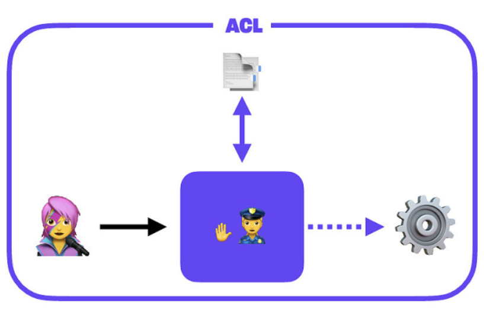
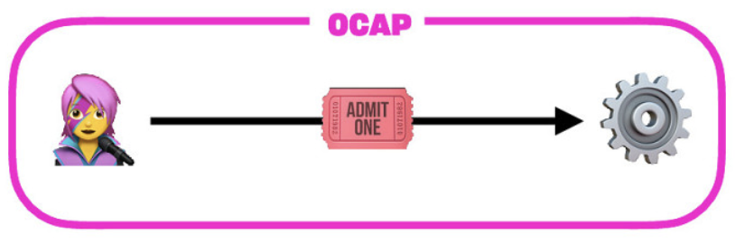

# Object Capability Model

> The structural properties of object capability systems favor modularity in code design and ensure reliable encapsulation in code implementation.\
> \
> These structural properties facilitate the analysis of some security properties of an object-capability program or operating system. Some of these — in particular, information flow properties — can be analyzed at the level of object references and connectivity, independent of any knowledge or analysis of the code that determines the behavior of the objects. As a consequence, these security properties can be established and maintained in the presence of new objects that contain unknown and possibly malicious code.
>
> — [Wikipedia](https://en.wikipedia.org/wiki/Object-capability\_model#Advantages\_of\_object\_capabilities)

Access control is mostly widely achieved via access control lists (ACLs): metadata or database tables that specify which user is allowed to perform which actions. This requires that the application boundary enclose all of the data and users. In fully centralized systems, this works reasonably well since all requests go through the same controlling source. However, as real world use cases inevitably expand, ACLs need to cover increasing complexity, exceptions, and roles. It often becomes error prone to write and maintain, and makes the ACL subsystem itself a target for attackers.

The object capability (OCAP) model works in the opposite mode. While ACLs are _reactive & centralized_, OCAP is _proactive & decentralized_ — an agent is allowed to perform some action if they have poof of those rights. This makes access control very granular, work offline, and in certain variants (like ours) empowers users to delegate rights to others to act on their behalf. This greatly simplifies access control by presenting a document that includes what the user is permitted to do. The complexity arises from managing which credentials exist, and revoking them. The standard approch is to maintain a public revocation list, which is checked on each request. We will go into that in more depth later.

Fission uses a blend of correct-by-construction read authorization and cryptographically-secured write certificates. This is a trustless method suitable to centralized, decentralized, peer-to-peer, and local-first applications. In essence, it means using a mix of signature chains to control who has access to what. Read access is granted by the mere fact that someone has the correct decryption key. Write access is mediated with signature chains, in a similar way to the common X.509 certificate. Rather than have a centralized application handle access control, this is usable everywhere, and under any circumstance.


It should be noted that Fission’s authorization system relies heavily on capabilities and less on identity. The concept of ”identity” is weak. A user holding at least all of the capabilities as the resource owner can be considered equal in all respects with regard to authorization.


## Comparison to Access Control Lists (ACLs)

### ACLs / Reactive Auth

The access control mechanism that is most widespread today is ACL. This works by keeping a list of users and what they're allowed to who (which resources and what they're able to do with them). This requires maintaining a complex mapping in a central location, plus a process that mediates the interaction.

This is a bit like having a guard outside of a building. You ask them to perform actions on your behalf. The stop you, check your ID, look up if you're allowed to do that, and pass the message along if so. If you break into the back of the building (sneak past the guard), you have full access.

The advantage of this reactive model is that it's very easy to remove capabilties from the central list. The disadvantage is that the list tends towards having very complex rules over time, and it doesn't scale well or work offline.

### OCAP / Proactive Auth

OCAP is less known today, but has good real-world analogies. For instance, a movie ticket asserts that you are allowed to watch a film at a certain location at a certain time. It doesn't depend on your passport or a list somewhere. If you're holding that ticket you're allowed in.

This scales very well and works offline, because it requires no central list. Having ticket _is_ the complete proof. This model doesn't require writing complex rules or maintaining state. It is said to be "proactive".

The downside is that revocation is more challenging. OCAP tends to use the [principle of least authority](https://en.wikipedia.org/wiki/Principle\_of\_least\_privilege) to scope what the grantee's capabilities to what is safe at the time it's issued. This can commonly include access to a narrow set of resources, an expiration time, and so on.

### Balance

Since they both have tradeoffs, it's rare to see a pure ACL or pure OCAP system. Typically they borrow some techniques from each other. For instance, an ACL-driven backend may issue stateless JWTs, or OCAP systems may maintain a (central or replicated) revocation list.
