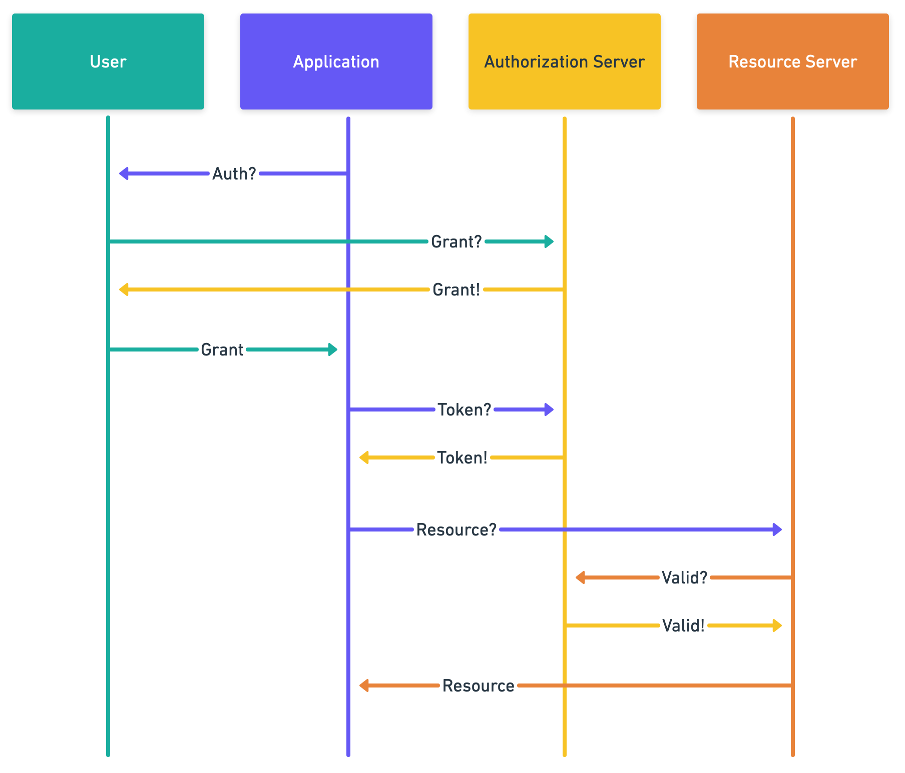
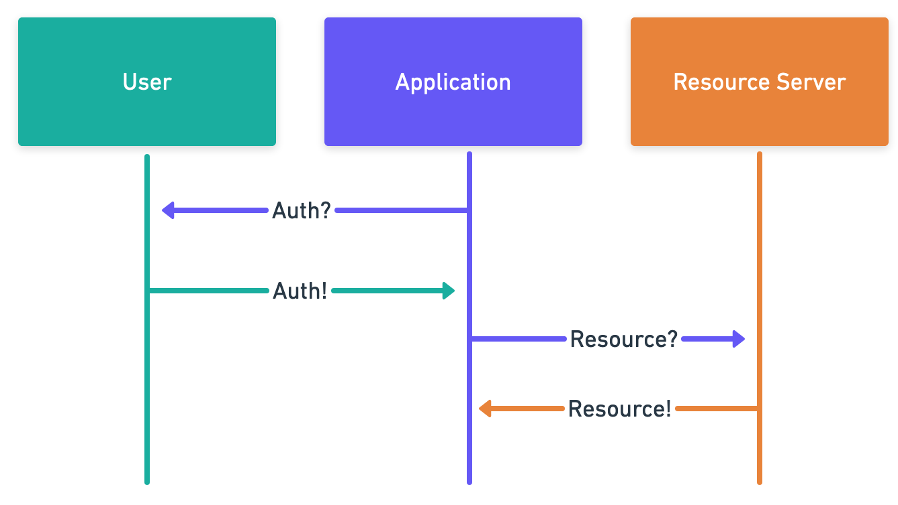

# Self-Signed Tokens

While Fission leverages self-sovereign identity, it still needs to be able to interact with existing systems and flows with the minimum amount of reworking possible. Bridging delegated authorization such as tokens \(commonly used by web 2.0 systems\) is fairly straightforward, and only minor modifications for the service, and continues to make sense in a web3 context.

Fission's self-signed tokens are a JWT-implementation of [macaroons](https://research.google/pubs/pub41892.pdf). These are bearer credentials — essentially a decentralized certificate that can be used to access external services on behalf of another user.

## Token Format

## Subdelegation

 of the token to trusted third-parties with even more limited access.

## One-Time Tokens

There are times when tokens should be single use. This is generally in situations where multiple users need to atomically collaborate on some action via some aggresating service.

### Additional Requirements

* The token must include the recipient \(i.e. scoped to the receiver\)
* Each token must be unique
  * If a request needs to be made multiple times, adjust the nonce
* Either
  * Strictly enforce ordering with a monotonically-increasing nonce
    * Version 1: If a require every token to be received before allowing the next
    * Version 2: Accept any token, but invalidate any previous tokens
  * Keep a rolling tally of used token by hash
    * Drop expired tokens from this cache since they can no longer be replayed

### Pros

* Secure & authenticated
* Self-sovereign
* Can Pre-signable
* Not susceptible to replay attacks
* Can be used as an authenticated proof of intent

### Cons

* Require the user \(or an authorized delegate\) to be online to sign a token
* The end-recipient maintain a token invalidation list for replay resistance to hold
* Typically requires the entire payload to be signed
  * i.e. requires all of the optional claims in the [JWT Authentication](https://app.gitbook.com/@runfission/s/whitepaper/~/-Lyqf_PlC7NGcLgfnH4p/identity/jwt-authentication#claims) section

## Differences from OAuth 2

Token authorization on the web is generally associated with OAuth.

### Classic Token Authorization

A typical OAuth flow today looks something like this:

1. Application requests access from user to access a resource server
2. Browser redirects to an authorization server
3. User authenticates with the authorization server
4. User selects the rights they would like to allow
5. Authorization server provides a temporary grant
   1. A grant record is created on the authorization server
6. Browser redirects back to the application
7. User provides the grant to the application
8. Application makes a request to the authorization server with the grant
9. The grant is exchanged for a time-limited access token with the rights the user specified
   1. The grant is invalidated in the authorization server's records
10. The application uses the token to make the request to the resource server
11. Resource service validates that the token is valid with the authorization server
12. Resource server performs action

### Self-Signed Token

In a self-signed system, this flow shortened as follows:

1. Application requests access from user
2. User is redirected to a well-known \(potentially self-owned\) authorization webpage
   1. Ideally a cached page, well known, and outside the influence of the application
3. User reviews and approves the appropriate permissions
4. User signs a JSON object that includes the delegated rights and the recipient
5. Browser redirects back to the application
6. User provides the self-signed token to the application
7. Application uses the token to make authenticated requests to the resource server
8. Resource server authenticates the application, user, and verifies authorization level
9. Resource server performs the action

This has several advantages, including fewer round trips, increased feasibility of short-lived or single-use tokens, and even further delegation as described above.

