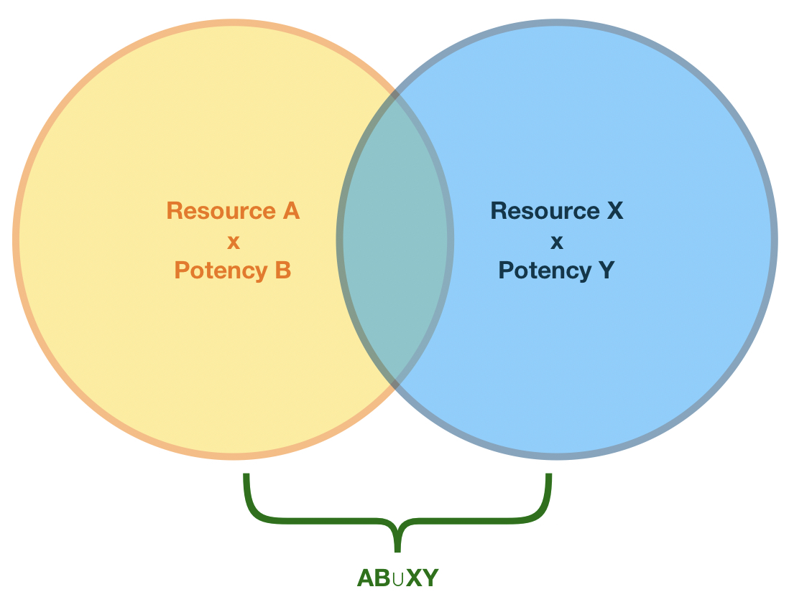

# Concepts

> 1. The world is everything that is the case  
> \[...\]  
> 1.13 The facts in logical space are the world  
>   
> — Wittgnstein, Tractatus Logico-Philosophicus

## Authorization Space

Content itself doesn’t have an implicit owner. Instead, let’s consider the space of all content. It has an X-axis — the types of content. It has a Y-axis — the range of elements of that type to be conferred. And it has a Z-axis — the depth or variety of rights you have over the other dimensions.

This authorization space includes all possible resources that can be addressed. In fact, UCANs themselves are entities that live in the authorization space, as well as their contents.

## Resource

A resource is a pointer \(e.g. URI, CID, address\) that represents a thing to be acted on. Examples include:

* DNSLinks
* Email address
* Domain names
* Fission usernames
* DIDs

## Potency

The potency are the rights on some resource. Each potency type has its own elements and semantics. They may by unary, support a semilattice, be monotone, and so on. Potencies may be considered on their own — separate from resources — and applied to different resources.

For example, `APPEND` is a potency for WNFS paths. The potency `OVERWRITE` also implies the ability to `APPEND`.

On the other hand, email has no such tiered relationship. You may `SEND` email, but there is no ”super send”.

## Scope

An authorization scope is the tuple `resource x potency`.

Scopes compose, so a list of scopes can be considered the union of all of the inner scopes.

You can think of this as ”scoping” the total rights of the authorization space down to the relevant volume of authorizations.

Inside this content space, can draw a boundary around some resource\(s\) \(their type, identifiers, and paths or children\), and ther potencies.

## Proof

Proofs are existing facts.

### Self-Evident UCANs

dsa

### Raw Facts

hsdajk

