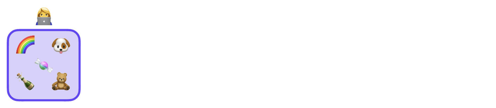
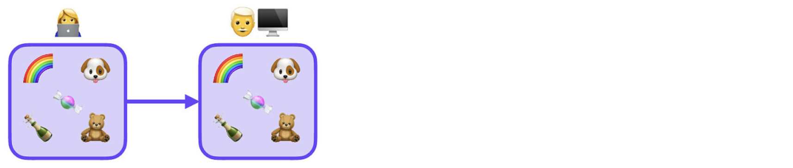
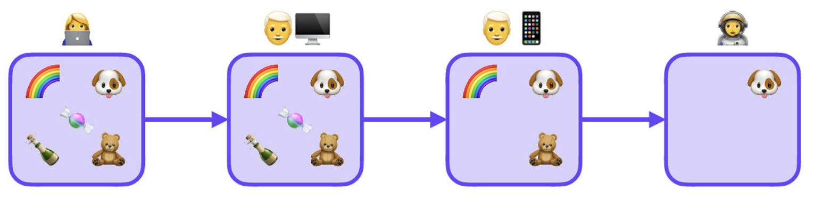
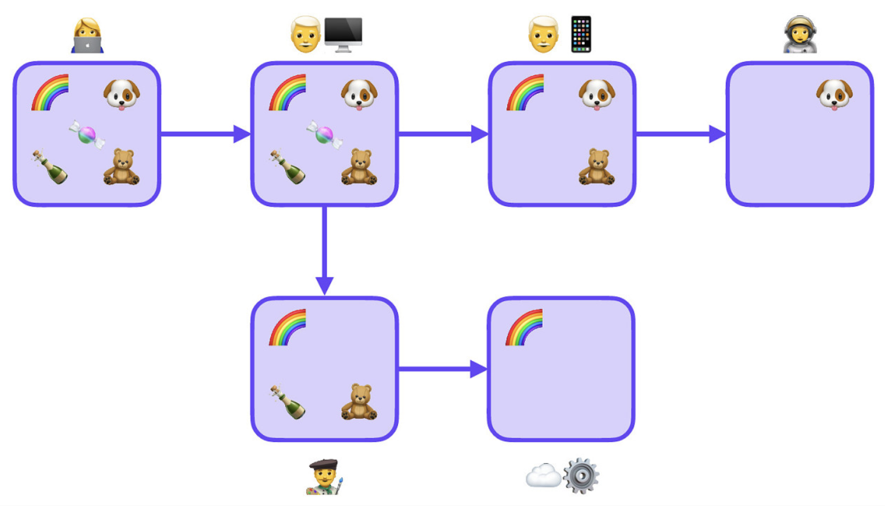
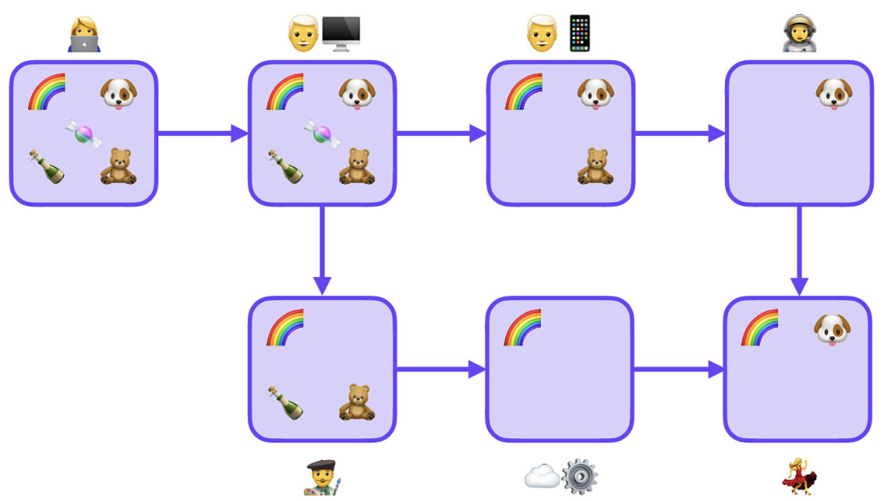
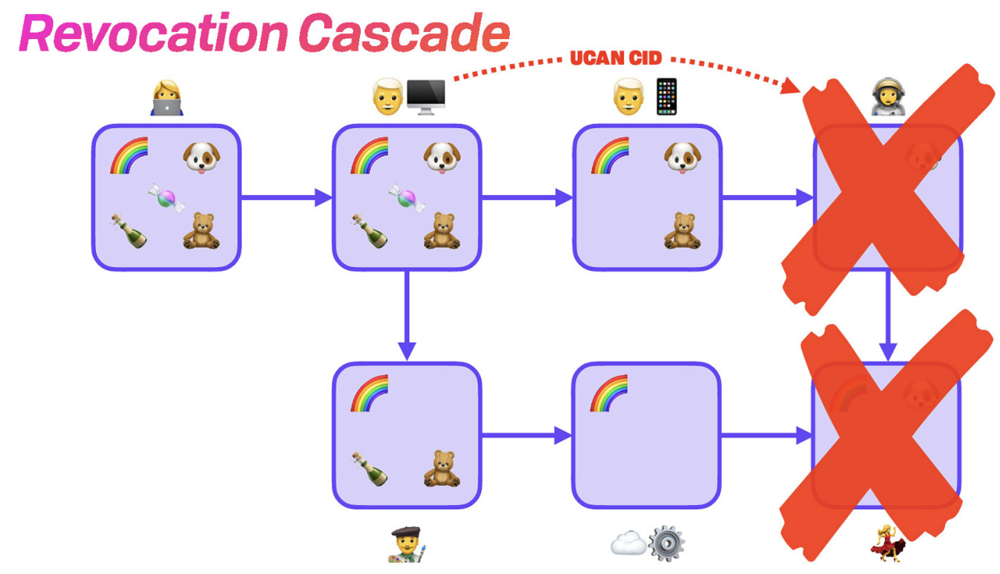

# Concepts

> 1\. The world is everything that is the case\
> \[...]\
> 1.13 The facts in logical space are the world\
> \
> — Wittgnstein, Tractatus Logico-Philosophicus

## Authorization Space

Content itself doesn’t have an implicit owner. Instead, let’s consider the space of all content. It has an X-axis — the types of content. It has a Y-axis — the range of elements of that type to be conferred. And it has a Z-axis — the depth or variety of rights you have over the other dimensions.

This authorization space includes all possible resources that can be addressed. In fact, UCANs themselves are entities that live in the authorization space, as well as their contents.

Judgements about the authorization space are [constructive](https://en.wikipedia.org/wiki/Intuitionistic\_logic). While it’s technically possible to express concepts like negation, we generally limit ourselves to making true statements and present positive facts.

## Resource

A resource is a pointer (e.g. URI, CID, address) that represents a thing to be acted on. Examples include:

* DNSLinks
* Email address
* Domain names
* Fission usernames
* DIDs

## User Controlled

Traditional client-server architectures are multi-tenant. You can think of this as being a single horizontal volume per app, with vertical stripes; one for each user. ACLs are intended to keep those stripes separate from each other. Sometimes this code is broken, and users are accidentally given access to each others data.

User-controlled data is a 90° rotation of the above picture. Users are in control of their data: it's stored single tenant, with apps asking for stripes of data. Here, the user is in control, and apps ask for permission to see some portion of the user's data.

What if you're writing a collaborative application, and it needs access across user stores? Not a problem: users can grant access to their stores, and the caller can glue these rights together.

.png>)

## Potency

The potency are the rights on some resource. Each potency type has its own elements and semantics. They may by unary, support a semilattice, be monotone, and so on. Potencies may be considered on their own — separate from resources — and applied to different resources. Potencies are extensible, and definiable to match any resource. For example:

`APPEND` is a potency for WNFS paths. The potency `OVERWRITE` also implies the ability to `APPEND`. Email has no such tiered relationship. You may `SEND` email, but there is no ”super send”.

## Scope

An authorization scope is the tuple `resource x potency`. Scopes compose, so a list of scopes can be considered the union of all of the inner scopes.


You can think of this as ”scoping” the total rights of the authorization space down to the relevant volume of authorizations.

Inside this content space, can draw a boundary around some resource(s) (their type, identifiers, and paths or children), and their capabilities (potencies).

As a practical matter, since scopes form a group, you can be fairly loose: order doesn’t matter, and merging resources can be quite broad since the more powerful of any overlap will take precedence (i.e. you don’t need a clean separation).

### Rights Amplification

A user holding two scopes may have more rights than the sum of their parts. The classic analogy is a can and can opener. Having access to both gives you the right to access the contents of the can, which you can't access with just the can or just the opener.

## Authorization Proofs

Proofs are existing facts. Typically these are UCAN chains, leading back to a self-evident origin token.


### Self-Evident UCANs

The originating UCAN contains no proofs. It is merely a UCAN signed by the private key associated with the corresponding account’s DID. As such, the proof _is_ the signature itself. We call these ”self-evident” or “origin” UCANs.

## Facts & Proofs of Knowledge

Logical or self-evident facts are a related form of proof. A statement of fact may be the inclusion of a CID in a Merkle tree, or a statement about the input to a hash.

As a simple example:

```
SHA3_256(”hello world”) = 0xa948904f2f0f479b8f8197694b30184b0d2ed1c1cd2a1ec0fb85d299a192a447
```

Perhaps non-intuitively, signing a challenge string also constitutes a fact: that you know the private key associated with some public key, despite not giving away the actual private key.

## Delegation

UCANs allow agents to delegate some (or all) of their rights to other agents — i.e. to act on their behalf. These form chains going all the way back to the resource originator/owner. Delegation (output) is _always_ a subset of the proofs (inputs).

As mentioned earlier, scopes can be merged (set union). If merging the inputs (proofs), the output scope is a subset of the proof union. While this relationship commutes, it needs to be emphasized that if _any_ proof of a certain input scope is given, it may be included in the output authorization scope.

### Example

Meet Alice. She owns a number of resources (the items in the box).



She wants to share all of them with Bob. She creates a UCAN that delegates right to everything to him. He now has all of Alice's capabilities. They are not the same person, but they can perform the same actions on these items.



Bob then want to also use this acces on his phone. He sometimes lets his neice (Carol) use his phone, so he doesn't want the phone to be able to access _everything_, so he scopes it down to just three capabilities and delegates to the public key on his phone.

Carol finds that she finds one of the capabilities very useful and asks if she can have access to it herself. Bob delegates just that one resource to Carol from his phone.



Later, Bob's partner David needs access to a few resources. Bob delegates those to him from his desktop. David later delegates one of the resources to a cloud service that manages batch tasks for him.



Finally, David's cloud service determines that his granddaughter, Evelyn, should aslo have access to this resource, and delegates it to her. She later has coffee with Carol, and finds that she would also like to have access to the dog resource! Carol delegates it to her. Now Evelyn has more access than Carol or the cloud server.



## Cascading Revocation

There is no way to provide a proof that negates another _inside_ a UCAN. UCANs can be negated at the whole-UCAN level only. Please see the relevant section for more.


