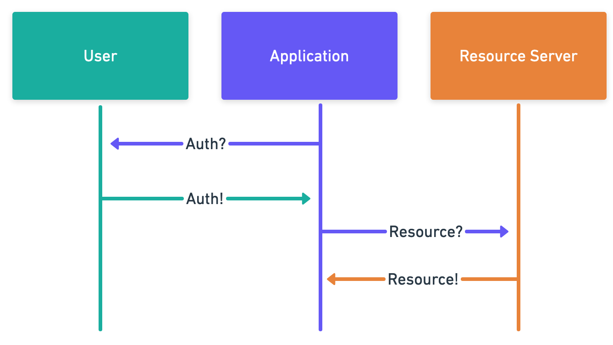

# Differences from OAuth

Token authorization on the web is generally associated with OAuth. A typical OAuth flow today looks something like this:

1. Application requests access from user to access a resource server
2. Browser redirects to an authorization server
3. User authenticates with the authorization server
4. User selects the rights they would like to allow
5. Authorization server provides a temporary grant
   1. A grant record is created on the authorization server
6. Browser redirects back to the application
7. User provides the grant to the application
8. Application makes a request to the authorization server with the grant
9. The grant is exchanged for a time-limited access token with the rights the user specified
   1. The grant is invalidated in the authorization server's records
10. The application uses the token to make the request to the resource server
11. Resource service validates that the token is valid with the authorization server
12. Resource server performs action

### UCAN

In a self-signed system such as a UCAN, this flow shortened as follows:

1. Application requests access from user
2. User is redirected to a well-known \(potentially self-owned\) authorization webpage
   1. Ideally a cached page, well known, and outside the influence of the application
3. User reviews and approves the appropriate permissions
4. User signs a JSON object that includes the delegated rights and the recipient
5. Browser redirects back to the application
6. User provides the self-signed token to the application
7. Application uses the token to make authenticated requests to the resource server
8. Resource server authenticates the application, user, and verifies authorization level
9. Resource server performs the action

This has several advantages, including fewer round trips, increased feasibility of short-lived or single-use tokens, and even further delegation as described above.

