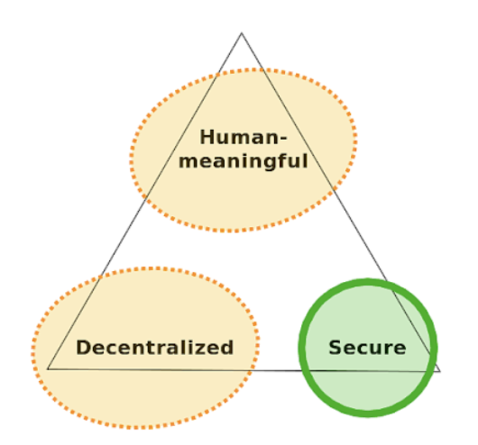

# Revocation

## Background

UCAN relies on a form of [PKI](https://en.wikipedia.org/wiki/Public_key_infrastructure). This is not a new idea, and has a long history with many attempts. This is a form of proactive authorization for mutations \(OCAP\). This works very well offline and fully P2P, takes our servers out of the equation completely, and puts all the power in the user's hands. Today these authorization tokens are fully self-contained. However, the downside is what to do when you've found misuse of these tokens, it would be good to be able to revoke them.

Our design constraints include maximizing user-controlled \(self-sovereign\) identity, in a vanilla browser, in the presence of network partitions. This requires the ability to communicate state, and to roll back incorrect changes in an eventually consistent way. These constraints also prohibits relying on a central authority such as a CA or blockchain, since these sources fail when not reachable.

Sibyl resistance is NOT a design goal. In fact, this is an anti-goal. A user should be able to create and destroy DIDs at will, and endow them with granular capabilities on a temporary or ongoing basis. Root user DIDs distribution is channel agnostic. As a first step, Fission has started with DNS `TXT` records to associate a human-readable name with a DID. This helps find an acceptable balance for [Zooko's Triangle](https://en.wikipedia.org/wiki/Zooko%27s_triangle).



This scheme is heavily centered on authorization over authentication. Creating tokens, and linking them together with signature chains endows a particular agent's DID with rights. These may be other users, machines, apps, processes, and so on. This delegation of rights is always attenuated: moving from high authority at the root/owner, to low authority at the delegate. This is not unlike [X.509](https://en.wikipedia.org/wiki/X.509), [SDSI/SPKI](https://en.wikipedia.org/wiki/Simple_public-key_infrastructure) or [Macaroons](https://storage.googleapis.com/pub-tools-public-publication-data/pdf/41892.pdf). These delegations are typically time limited.

## Scenario

* The user discovers abuse of a delegation \(e.g. stolen laptop, memory hack, etc\)
* They want to revoke that key, and thus also any subdelegations
* The subdelegations may have been used anywhere
* While the signatures are still valid, but the token should not be

## Solution

Revocation is done by placing the offending token in a modified Merkle Patricia tree \("MMPT"\) as close to the resource as possible. In the case of Fission, this generally means in a well known, immutable location on WNFS. These can be copied and merged widely, since each token is unique and there is little overhead to maintaining large lists.

### Revoker Authentication

Revocation is an implicit right to any DID used in the proof section of a UCAN. Essentially if you delegated, you can revoke anything below in the delegation chain. This applies to any depth, from the direct delegation to the a deeply nested one.

Authorization needs to be passed along with the invalidated UCAN. This is done by wrapping the UCAN in question with the a signature, the DID in the chain used to sign, and the CID of the UCAN in question. The values are formatted with [multiformats](https://multiformats.io/). Including the key `revoke` in the signature is taken as a check that the intention was to revoke rather than simply sign some arbitrary data.

```javascript
{
  "revoke": {
    "iss": "did:key:z6MzEksDrxkwYmpzqBdAQjjx1PRbHG3fq4ChGeJcYUYU44a4CBUExTTjeCbop6Uur",
    "cid": "QmT78zSuBmuS4z925WZfrqQ1qHaJ56DQaTfyMUF7F8ff5o"
  },
  "sig": "U0zcEmIwarhV11B9sDDsSJ1qJQqLDsjzPVrfXGSjsuT0="
}

// `sig` is calculated by (pseudocode)
"U" + base64(0x13 + sign(secretKey, JSON.stringify(
  {
    "revoke": {
      "iss": "did:key:zStEksDrxkwYmpzqBdAQjjx1PRbHG3fq4ChGeJcYUYU44a4CBUExTTjeCbop6Uur",
      "cid": "QmT78zSuBmuS4z925WZfrqQ1qHaJ56DQaTfyMUF7F8ff5o"
    }
  }
))
```

It is indexed by the CID, and then broken out into DIDs. We can always reconstruct the above format to check the signature, so we only need to store the signature at the leaf

```javascript
// {CID => DID => {base64revocation}}

{
  "QmT78zSuBmuS4z925WZfrqQ1qHaJ56DQaTfyMUF7F8ff5o": {
    "did:key:zStEksDrxkwYmpzqBdAQjjx1PRbHG3fq4ChGeJcYUYU44a4CBUExTTjeCbop6Uur": {
      "claim": "UeyJyZXZva2UiOnsiaXNzIjoiZGlkOmtleTp6U3RFa3NEcnhrd1ltcHpxQmRBUWpqeDFQUmJIRzNmcTRDaEdlSmNZVVlVNDRhNENCVUV4VFRqZUNib3A2VXVyIiwiY2lkIjoiUW1UNzh6U3VCbXVTNHo5MjVXWmZycVExcUhhSjU2RFFhVGZ5TVVGN0Y4ZmY1byJ9fQ",
      "sig": "U0zcEmIwarhV11B9sDDsSJ1qJQqLDsjzPVrfXGSjsuT0="
    }
  }
}
```

### Performance

#### Lookup

Proofs of non-inclusion in an MMPT are very efficient, and you are not required to actually keep the revoked UCAN itself, just the CID. Lookup performance can be further improved with a Bloom filter acting as a lookup cache.

#### Distribution

Aggressively replicating from peers is known as a gossip network. In an idealized case, it takes `log n` time to concurrently address everyone in a network. This ideal case is not generally what you see in practice, since some peers may be partitioned from the rest of the network. Further, the topology of our network is uneven, with large hubs including the Fission server. 

Fission itself being a large, well known hub that participants generally interact with is an advantage: it's an easy place to get a performant update on revocation without depending on strict centralization.

Partitioned nodes may make changes with outdated certificates prior to rejoining the main network. This is fine, as any updates with invalid credentials will be rejected by the broader network. Being immutable and versioned means that this is entirely solvable in an eventually consistent manner.

#### Space

All parties are encouraged to aggressively replicate revoked CIDs.

These revocation trees grow with the number of entries. UCANs are always time bound, and can be evicted or moved to slower storage as the UCAN becomes expired, since they can self-invalidating at that point.

