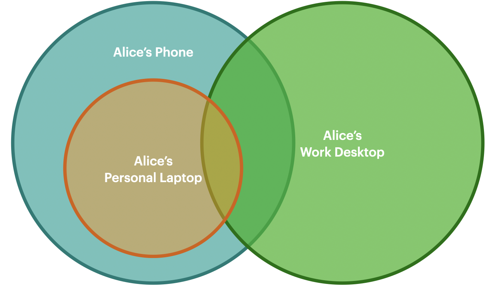
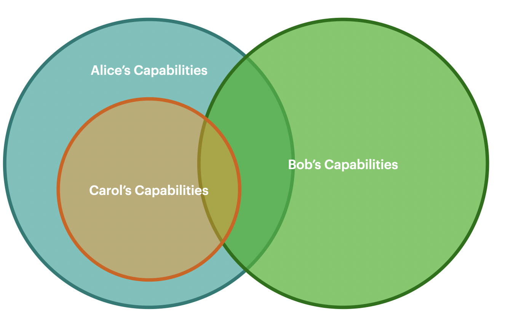

# Login

The concept of "logging in" conveys the ability of a user to access and/or modify resources.

This has historically been done with some proof of identity, via a password or other secret. More sophisticated systems have used challenges to prove ownership of email, public key signatures, or zero knowledge proofs, and biometrics to improve security and convenience. To wit, the metaphor is one of identity \("I log in to _my_ account _provided by_ an app"\) rather than one of action \("I am _empowered_ to complete _my task_"\).

As mentioned elsewhere, Fission has an intentionally weak concept of "identity". This is a system more on "authorization" than "authentication". A user may be said to have "logged in" to an app if they have the necessary permissions available to perform actions as that user for their current application.

However, the app is an agent of the user, and its codes ultimately performs actions on the users behalf. Perhaps a better view is that the user empowers the app with the delegated capabilities required to carry out tasks on their behalf. It is a model where the human is in control, not the app.

## Building Intuition

Traditional logins and account systems are no more "natural" than [using a mouse](https://www.youtube.com/watch?v=uUZ5fvsZMi4). However, since this pattern has been common for so long, it can help to look at an example. To help illustrate how this can work differently from our habitual intuitions, here is a quick illustration:

This first image above shows a scenariothat you may be familiar with. The circles represent capabilities, for example access to an email account, access to social media, or a cached files. Alice's work desktop has very different but slightly overlapping capabilities from her personal laptop or phone. Alice's most active device is her phone, and so it has more capabilities than her laptop. We can see that Alice fills many roles across her personal life, work life, and aspects of both. They are all the same human being, but each persona behaves differently and is expected to maintain some degree of separation \(e.g. no sensitive documents brought home, or NSFW photos on her work desktop\).

This image has only changed the labels. Here, Alice, Bob, and Carol have overlapping capabilities in the same relationship as seen earlier. Alice is able to do everything that Carol can, but not vice versa. From the point of view of an application that Carol has access to, Alice is _functionally equivalent_ to Carol. On the other hand, Carol is unable to access all of Alice's resources. Bob has some shared resources with both Alice and Carol, but far more that are unshared.

