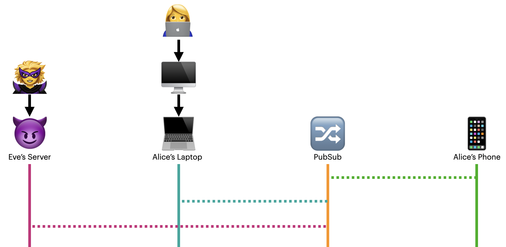
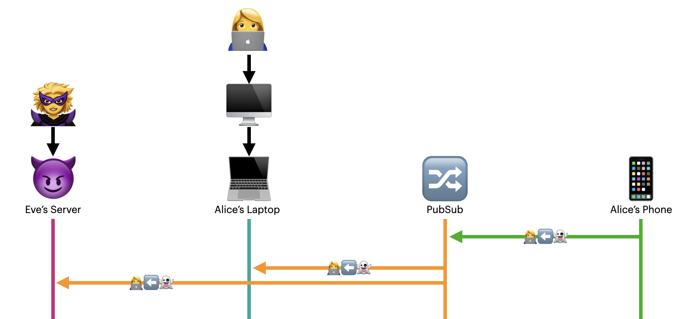

# AWAKE

There are several ways to send this information securely, but here we will be solving for the most difficult and universal case: over pubsub. These messages are visible to the world. We want to prevent man-in-the-middle attacks and other forms of spoofing. While we have a list of known-good exchange keys in DNS \(and later right in the user's WNFS\), we would like to avoid hitting the network as much as possible. Luckily, we can bootstrap up a secure channel with a known ID on one side and a challenge nonce on the other.

It should be noted that the bootstrap process here may also be used to set up secure channels for other use cases, including chat.

## Sequence

### Summary

* Both parties subscribe to a well-known channel
* Consumer broadcasts a temporary DID
* Producer securely proves that they have sufficient rights
* Securely agree on a symmetric key
* Consumer sends actual DID, along with a PIN
* Producer validates PIN out of band
* Producer creates and sends relevant UCAN and keys

### Dramatis Personae

#### People

| Icon | Name | Goal |
| :--- | :--- | :--- |
| 👩‍💻 | Alice | The root user, attempting to link a second device |
| 🦹‍♀️ | Eve | An attacker attempting to gain access to Alice's account |

#### Machines

<table>
  <thead>
    <tr>
      <th style="text-align:left">Icon</th>
      <th style="text-align:left">Name</th>
      <th style="text-align:left">Role</th>
    </tr>
  </thead>
  <tbody>
    <tr>
      <td style="text-align:left">&#x1F5A5;</td>
      <td style="text-align:left">Alice&apos;s Desktop</td>
      <td style="text-align:left">
        <ul>
          <li>Alice&#x2019;s original &#x201C;root&#x201D; device</li>
          <li>Does not participate in the example flow, but exists offline</li>
          <li>Has a PK corresponding to <code>did:key:zALICE</code>
          </li>
        </ul>
      </td>
    </tr>
    <tr>
      <td style="text-align:left">&#x1F4BB;</td>
      <td style="text-align:left">Alice&apos;s Laptop</td>
      <td style="text-align:left">
        <p></p>
        <ul>
          <li>Alice&#x2019;s second device &#x2014;&#xA0;the &quot;producer&quot;</li>
          <li>Has a PK corresponding to <code>did:key:zLAPTOP</code>
          </li>
          <li>Has an existing UCAN for Alice&apos;s account</li>
        </ul>
      </td>
    </tr>
    <tr>
      <td style="text-align:left">&#x1F4F1;</td>
      <td style="text-align:left">Alice&apos;s Phone</td>
      <td style="text-align:left">
        <p></p>
        <ul>
          <li>Alice&apos;s iPhone &#x2014;&#xA0;the &quot;consumer&quot;</li>
          <li>The device requesting linking for Alice&apos;s account</li>
          <li>Has a PK corresponding to <code>did:key:zPHONE</code>
          </li>
        </ul>
      </td>
    </tr>
    <tr>
      <td style="text-align:left">&#x1F608;</td>
      <td style="text-align:left">Evil Server</td>
      <td style="text-align:left">
        <p></p>
        <ul>
          <li>Eve&apos;s server that observes all pubsub traffic</li>
        </ul>
      </td>
    </tr>
  </tbody>
</table>

### **Step 1: Everyone Subscribes to Channel**

All parties listen for messages on a channel named for the root DID. A peer that can issue UCANs must be online and listening on this channel

#### Example

An example pubsub topic may look like:

```text
deviceLink#did:key:z6MkgYGF3thn8k1Fv4p4dWXKtsXCnLH7q9yw4QgNPULDmDKB
```

💻 \(who has a UCAN already\) and 📱 \(requestor\) listen for incoming messages on channel `did:key:zALICE`



### **Step 2: Consumer Broadcasts an Temporary Public Key**

This gives everyone on the channel a 2048-bit RSA public key to send secret data to. Here we call the associated DID `did:key:zTHROWAWAY`.

This key MUST be _temporary_, as public key as encryption and signing keys MUST be different. This temporary key is ONLY used to bootstrap a channel, and MUST NOT live beyond that time. It is ideally non-exportable, especially in the browser via the [WebCrypto API](https://developer.mozilla.org/en-US/docs/Web/API/Web_Crypto_API).

RSA is used because it is available with a nonexportable key in browsers, is ubiquitous on all other systems, and is not considered likely backdoored \(the NIST ECCs are [considered highly suspect](http://safecurves.cr.yp.to/)\).

#### Example

📱 broadcasts the cleartext message `did:key:zTHROWAWAY` on the channel `did:key:zALICE`



### **3. Provider Opens a Secure Channel**

Since RSA-OAEP is slow and can only hold a small amount of data, we use it to open a secured channel over AES256-GCM.


At this step, you **DO NOT KNOW** that the provider is actually our other machine, and not a person-in-the-middle 🦹‍♀️😈 You will _authenticate_ them via a capability check in the next step.



Note that there is nothing special about AES256-GCM. This key is symmetric and will be available in memory. As such, this protocol gains little from the WebCrypto API aside from potential hardware acceleration \(which can be helpful against certain timings attacks\).

In a future version, AES-GCM may be replaced with AES-SIV-GCM or XChaCha20-Poly1305.


The producer 💻 sends an asymmetrically encrypted AES256-GCM session key to the temporary public key that was broadcast by the consumer. The producer will ONLY respond to ONE request over this channel at a time. It is locked to the one temporary DID until the AWAKE completes successfully, is rejected, or times out. New connections MUST use new randomly generated keys temporary DIDs and AES-GCM session keys. The producer SHOULD track keys that they have already seen, and reject new requests involving them.

### **4. Session Key Negotiation over UCAN**

This step is both a "preflight" and provider authentication via UCAN.


Up to this point, Eve 🦹‍♀️ may be impersonating Alice 👩‍💻. This step proves a priori that the provider that sent the session key actually does hold the capabilities that are being requested.

Eve 🦹‍♀️ has no incentive to delegate rights other than to hide from detection. However, in this scenario where she somehow already has a valid UCAN, the game was already over. There are remedies available \(revocation & rotation\) were that to happen. AWAKE aims to minimize this possibility from the outset \(Alice 👩‍💻 would have to agree to granting Eve 🦹‍♀️ these rights due to human error\).


This step MUST NOT delegate any rights \(`att = []`\), but MUST include the entire proof chain that will be used in the actual credential delegation later. For the consumer, this is an _a priori_ proof that you are communicating _directly_ with an authorized machine, that has access to at least the capabilities that you are interested in.

The AES256-GCM session key MUST be included in the "facts" \(`fct`\) field. Since UCANs are signed, this is used to assert that the session key came directly from the authorized user.


This will tell us that the sender intended that key for us, and no others. It is predicated on the assumption that the **provider never reuses that key** in any other channel.


In short, this step proves provides two things:

1. Proves that you are talking to a machine that does, in fact, have the correct rights that you're looking to have delegated
2. Authenticates the 256-bit AES key to make sure that the session key hasn't been tampered with

#### Example

💻 responds by broadcasting a "closed" UCAN on channel `did:key:zALICE`, encrypted with the session key. The embedded UCAN is proof that the sender does, in fact, have permissions for the account, but it does not delegate anything yet. The facts section \(`fct`\) includes the same session key that is used to encrypt the data on this channel.

```javascript
// A UCAN with sent to the THROWAWAY address with *no delegation*
closedUcan.claims.iss = `did:key:z${LAPTOP}`
closedUcan.claims.aud = `did:key:z${THROWAWAY}`
closedUcan.claims.fct = [..., {"sessionKey": sessonKeyAES256}]
closedUcan.claims.att = [] // i.e. MUST delegate nothing
closedUcan.claims.prf = [...proofs] // May be omited if on the root machine

closedUcan.signature = rsaSign({
  secretKey: LAPTOP_SK,
  tokenHead: closedUcan.header,
  tokenClaims: closedUcan.claims
})

// Encrypt the token
const encryptedPayload = rsaEncrypt({
  to: IPHONE_PK, 
  payload: closedUcan
})
```

Here we're _securely_ responding with a randomly generated AES256 key, embedded in the UCAN's "facts" section. Since UCANs are signed, and the audience is the recipient, we have proof this message was intended for the recipient and has not been modified along the way.

The recipient MUST validate the following:

1. The encrypted message can be decrypted by SK associated with the `ucan.aud`
2. Signature chain — from the outermost JWT signature, all the way through nested UCANs back to the root
3. The first-level proofs \(EXACTLY one level above\) MUST contain the permissions that you are looking to be granted \(not two nested levels of \`att: \[\]\`\), OR be the root credential.
4. The innermost \(root\) issuer \(`iss` field\) MUST match the channel's DID \(i.e. the DID that you are requesting from\).


If any of the above does not match, you MUST ignore that message and start again. It's Eve's machine trying to establish a person-in-the-middle attack \(PITM\) 😈


### **5. PIN Validation**

Steps 1-3 establish a connection with _a requesting machine_, but not necessarily _the user's machine_. To validate that this is the correct user, we go out of band and have the human verify a code.

The requestor displays a challenge \(PIN code\) to the user. It sends the PIN and DID/signing key \(encrypted with the AES key\) over pubsub. The UCAN holder decrypts and displays this PIN to the user and asks them to confirm that it matches. If it matches, you are talking to the correct machine, and you have the DID to delegate to 🎉

#### Example

📱 receives the above message and extracts the sender's DID \(and thus PK\). It then [verifies](https://developer.mozilla.org/en-US/docs/Web/API/SubtleCrypto/verify) that the sender's PK is in the list of exchange keys found in DNS for the target username.


If PIN validation fails, you MUST ignore the message. It's Eve trying to get you to delegate rights to her 🦹‍♀️ **You MUST start over, since that channel is compromised.**


### **6. Credential Delegation**

Now that we know that the message can be trusted, the token holder creates a UCAN with delegate rights for the requestor using their DID from the most recent message. Send that UCAN and the WNFS read key \(which is also an AES key\) back over the pubsub channel — of course, encrypted with the AES session key.

```javascript
aesEncrypt(
  key: sessionKey,
  payload: {
  "readKey": wnfsReadKey,
  "ucan": newUcan
})
```

