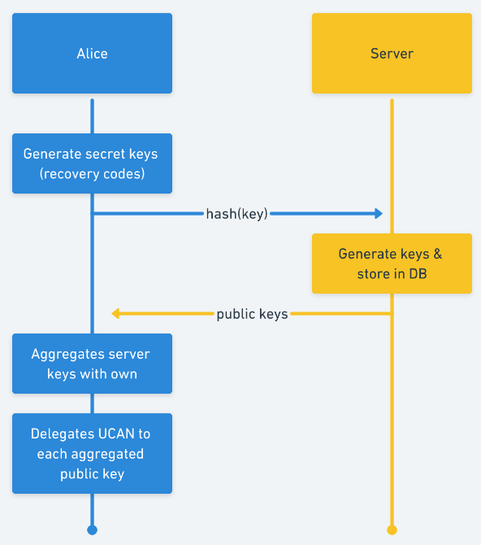
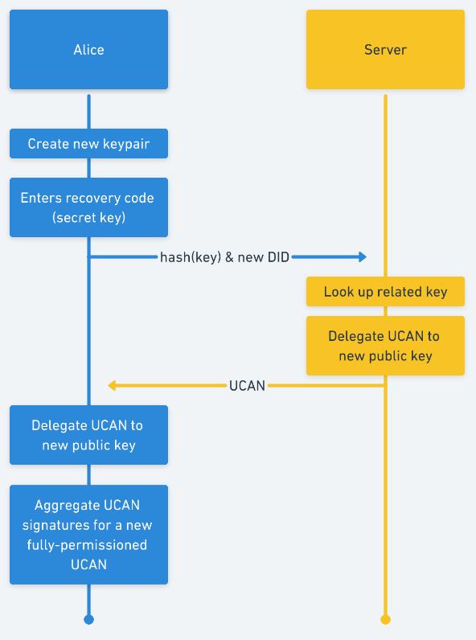
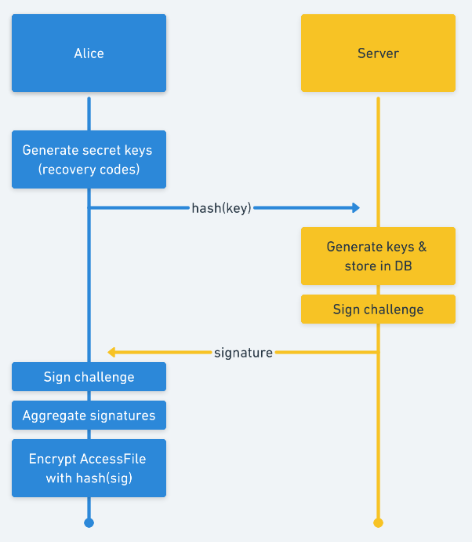
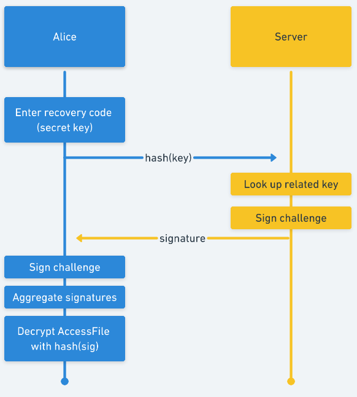

# Recovery

## Secure Account Recovery

A user must be able to recover their account and file system in a privacy-preserving way that reveals no information to Fission.

* **Read Access:** By decrypting a root AES key that reveals access to the `/private` branch of the filesystem
* **Write Access:** By delegating full write access to a new DID through a UCAN

### Constraints

* Users should have a set of recovery codes \(similar to 2FA recovery codes\) such that any one recovery code has the capability of restoring full access to a user's filesystem
* Upon recovery, a user's DID should have an unbroken chain of delegation from their original DID \(even though they no longer have access to that key pair\)
* Fission should not be able to restore or have access to a user's filesystem without access to their recovery codes
* Fission should have the ability to stop or slow access to a filesystem in the case of suspicious activity

### Basic Outline

A user generates a number of recovery tokens on account creation. Each recovery token is a 256-bit BLS secret key. The server also holds BLS secret keys, one for each token that a user possesses. When the user and the server both sign the same data, and the signatures are "added", the public key of that signature is the same as the user's and the server's public keys "added" together \("added" here refers to BLS aggregation\).

To allow **Write** permission recovery, the user permissions a UCAN for the that aggregated public key. In the event of recovery, the user and the server work together to sign another UCAN for a _new_ key pair that the user creates. This signature is aggregated from the user's recovery code and the associated secret key that the server is holding.

To allow **Read** permission recovery, the user stores an encrypted AccessFile in the `/recovery` directory of their filesystem \(one for each recovery token\). This AccessFile contains the root AES key for decrypting the `/private` branch of the filesystem. The AES key to decrypt this file is determined by aggregating the user's and server's signatures of some known challenge \(for instance, the user's username\) and hashing the result.

### Creation & Recovery Flow

_Note: we separate the read & write flows here for clarity, but they will be done at the same time with the server_

#### Write Creation

* Alice
  * generates 10 random BLS secret keys \(`SK_a`\)
  * takes the SHA256 hash of each of these secret keys
  * sends the hashes to the server
* The server
  * generates 10 BLS secret keys \(`SK_f`\), one for each hash, and stores them in a database alongside the hashes
  * sends Alice the public key for each \(`PK_f`\)
* For each key, Alice
  * combines the public key with the relevant public key from the server to determine `PK_agg`
  * determines a did for each `PK_agg`: `did:key:zAliceRecovery`
  * delegates a full permission UCAN \(`UCAN_recovery`\) to each `did:key:zAliceRecovery`, attested by her root  `did:key:zAlice` 



#### Write Recovery

* Alice
  * enters one of her recovery codes, `SK_a` 
  * creates a new key pair `(SK_r, PK_r)` and associated DID `did:key:zAliceNew`
  * sends a request to the server including `SHA256(SK_a)` and `did:key:zAliceNew`
* The server 
  * looks up the relevant key to `SK_a` in the database: `SK_f` 
    * _Note: We can add a time delay on this part for added security. If a user reports their device missing or their security breached, this is also where we can halt an attacker._
  * alerts Alice if the key does not exist
  * otherwise, signs a full permission UCAN \(`UCAN_new_f`\) from `did:key:zAliceRecovery` for `did:key:zAliceNew` 
  * `UCAN_new` to Alice
  * deletes the key pair from the DB
* Alice
  * signs a full permission UCAN \(`UCAN_new_a`\) from `did:key:zAliceRecovery` for `did:key:zAliceNew` 
  * combines `UCAN_new_a` with `UCAN_new_f` to create `UCAN_new`, a fully permission UCAN for `did:key:zAliceNew`



#### Read Creation

* Alice
  * generates 10 random BLS secret keys \(`SK_a`\)
  * takes the SHA256 hash of each of these secret keys
  * sends the hashes to the server
* The server
  * generates 10 BLS secret keys \(`SK_f`\), one for each hash, and stores them in a database alongside the hashes
  * signs some arbitrary piece of data `challenge`with each key
    * _Note: `challenge` does not have to be obscure; we can use the user's username for consistency_
  * sends Alice the signature for each key \(`sig_f`\)
* For each key, Alice
  * signs the same `challenge` with each key to obtain `sig_a`
  * combines that signature with the relevant signature from the server to obtain `sig_agg`
  * creates an `AccessFile` for each `UCAN_recovery` and includes the root AES key \(`R_root`\) to decrypt the user's private filesystem

```text
# AccessFile

{
  root: did:key:zAlice,
  username: alice.fission.name,
  rootAesReadKey: R_root,
  recoveryPartnerBlsPublicKey: PK_f,
  delegatedUcan: UCAN_recovery
}
```

* Alice 
  * takes the SHA256 hash of `sig_agg` to determine an AES256 key `R_recovery` 
  *  encrypts `AccessFile` with each `R_recovery` key and stores it in their filesystem at `/recovery/{sha256(R_recovery)}`



#### **Read Recovery**

* Alice
  * Enters one of her recovery codes, `SK_a` 
  * Sends a request to the server including `SHA256(SK_a)` 
* The server 
  * Looks up the relevant key to `SK_a` in the database: `SK_f` 
    * _Note: We can add a time delay on this part for added security. If a user reports their device missing or their security breached, this is also where we can halt an attacker._
  * Alerts Alice if the key does not exist
    * Otherwise, signs the original `challenge` with `SK_f` to obtain `sig_f`
  * Sends `sig_f` to Alice
  * Deletes the key pair from the DB
* Alice
  * Signs `challenge` with `SK_a` and combines the result with `sig_f` to obtain `sig_agg` 
  * Takes the SHA256 hash of `sig_agg` to obtain  AES256 key `R_recovery` 
  * Retrieves the encrypted `AccessFile` from `/recovery/{sha256(R_recovery)}` 
  * Decrypts `AccessFile` with `R_recovery` 
  * Uses `R_root` from the decrypted `AccessFile` to decrypt her `/private` filesystem



### Fission Backup

Fission can also offer to store a backup key for the user's account in a secure location. 

There is a trade-off here: **security/privacy** for **ease of use**. A user can guarantee that they won't be locked out of their account and can log into new accounts without going through the device linking process. But they will rely on Fission to keep their key safe, and Fission would have the technical capability to view their filesystem \(although their filesystem will remain encrypted at rest, and this would, of course, go against our principles\). The security/privacy deficit of this would still be less than a traditional Web 2.0 architecture. 

In this case, a user's backup key would be stored in a Hardware Security Module.

#### Creation

* The server
  * Generates a new key pair `(SK_f, PK_f)` and related DID `did:key:zFissionRecovery` and stores it in an HSM
  * Sends `PK_f` to Alice
* Alice
  * Creates a full permission UCAN `UCAN_Fission_Recovery` for `PK_f` 
  * Sends `UCAN_Fission_Recovery` to the server
  * Uses key exchange to securely send the root AES key \(`R_root`\) to the server
* The server
  * Stores `UCAN_Fission_Recovery` in the DB
  * Securely store `R_root` in the HSM

#### Recovery

* Alice
  * Creates a new key pair `(SK_a, PK_a)` and related DID `did:key:zAliceNew` 
  * Sends `PK_a` to the server
* The server
  * Creates a full permission UCAN `UCAN_Alice_New` for `PK_a` using `SK_f` and extending `UCAN_Fission_Recovery` 
  * Sends `UCAN_Alice_New` to Alice
  * Uses key exchange to securely send the root AEES key \(`R_root`\) to Alice
* Alice
  * Unlocks her private filesystem with `R_root` 
  * Stores `UCAN_Alice_New` in her filesystem

## Account Reconstruction

In the event that a user is locked out of all of their devices and loses all of their recovery codes, they can undergo account reconstruction. They are able to retain their username, namespace, and public filesystem. However, they will not able to gain access to their private filesystem, and in effect resets all of the user's UCANs and then revokes access to any app that a user has permissioned.

To reconstruct an account, a user generates a completely new root AES key for their filesystem, and a new base key pair and related DID for their account. Fission sets their DID at `_did.${username}.fission.name}` to the newly generated DID.

The user then backs up their existing file system \(in case that they do find the necessary recovery codes\), creates a new `/private` branch of the filesystem \(encrypted with the newly created root AES key\), and updates `_dataroot.${username}.fission.name` to the root of this new filesystem.

