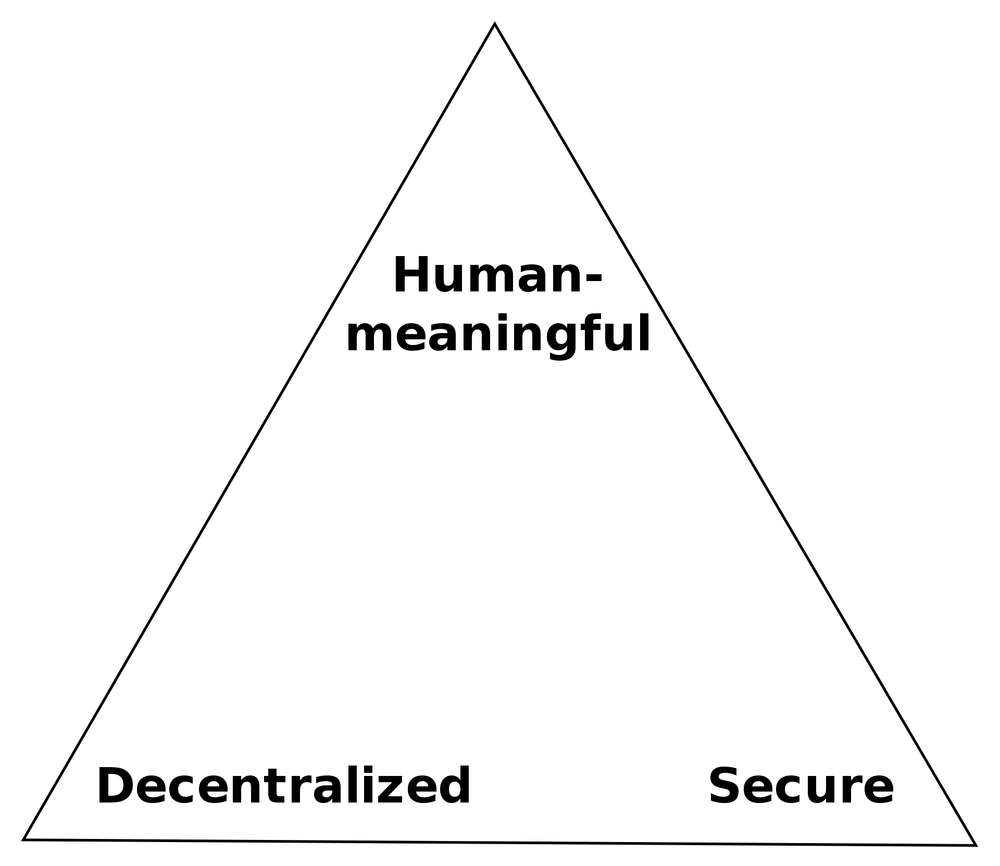

# Registration

In the Fission model, users own and manager their DID, not the service. Unfortunately, due to Zooko's Triangle \(a trilemma, illustrated below\), a raw DID is not particularly user-friendly. Further, all resources in Fission are based on immutable data. This is an intentional separation of concerns: a handful of mutable pointers are much easier to manage in any setting, especially a distributed one.

## Distribution & Mutability

These constraints mean that the model is flipped from existing systems: the user is in complete control of their data and identity, but need help with human-readable distribution. These may absolutely be self-managed or self-hosted, but in all cases one needs to reserve some portion of a shared namespace.

There are many approaches to this, including key networks and blockchains. The only of these methods that is universally supported today is the Domain Name System \(DNS\). DNS is a decentralized, global key/value store with support from every internet connected device.

### Pointer Mappings

The mapping of names to DIDs is provided by [DID-in-DNS](https://datatracker.ietf.org/doc/draft-mayrhofer-did-dns/), with extensions for large self-describing keys.

The mapping of the data root \(CID\) of a Merkle tree is stored in the [DNSLink](https://dnslink.io/). At time of writing, Fission represents this at `_dnslink.${username}.files.fission.name`.

