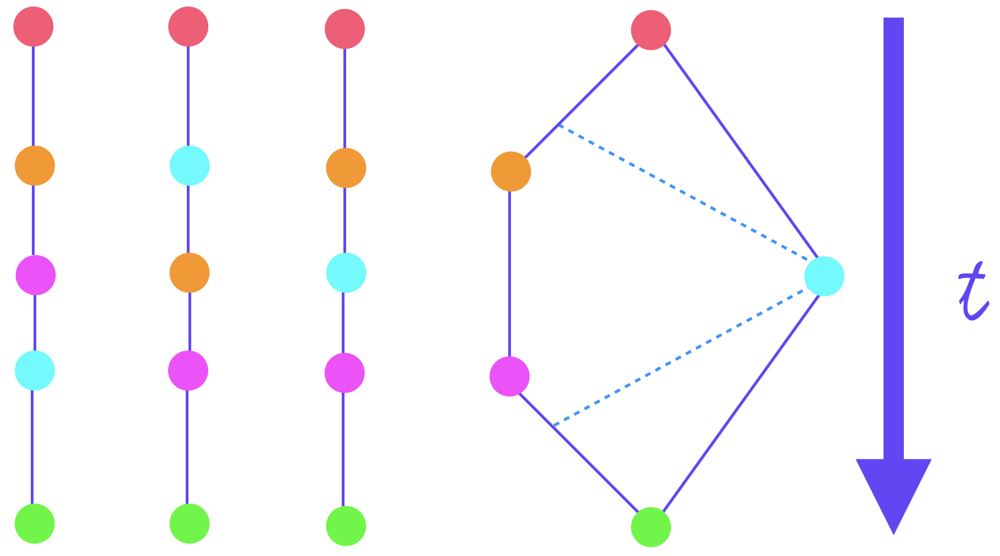

# Transactions

WNFS is transactional, lock-free, and concurrent. Updates are made atomically, and bundling multiple actions together is allowed. This is achieved by maintaining a local fork of the state, and only persisting it to the network \(an irreversable comittment\) when it is certain of its state. 

Bundling multiple states has many advantages, including lower synchronization overhead, 

Atomic updates can be associativity merged locally before being shared with the network. These are stored as closures, and run on the \*\*\*. _Suspended_ \_\_\_\_\_\_\_. They can be re-run before being settled.

This is simple function composition, and forms a monoid on transactions:

$$
(Transaction, ∘, λx.x)
$$

  
While suspended, the local copy can continue to accept updates without creating a confluent branch. This is desirable since it avoids runtime linearlization.

## Mechanics

### Out of Order Execution

To achieve concurrent speedups, execution of multiple actions are performed concurretly on forks of the current finalized head, and then [linearized](https://en.wikipedia.org/wiki/Linearizability) and merged \(i.e. the well-used [fork/join model](https://en.wikipedia.org/wiki/Fork%E2%80%93join_model)\). This is less efficient in serial, but has massive improvements in wall-clock time when multiple threads are available \(as is common in IPFS\).

This makes heavy use of the fact that \_\_\_

This requires a 

### Compare-and-Swap

WNFS avoids the ABA problem thanks to Merkelization. Instead of comparing values \(equality\), we check CIDs \(identity\).

