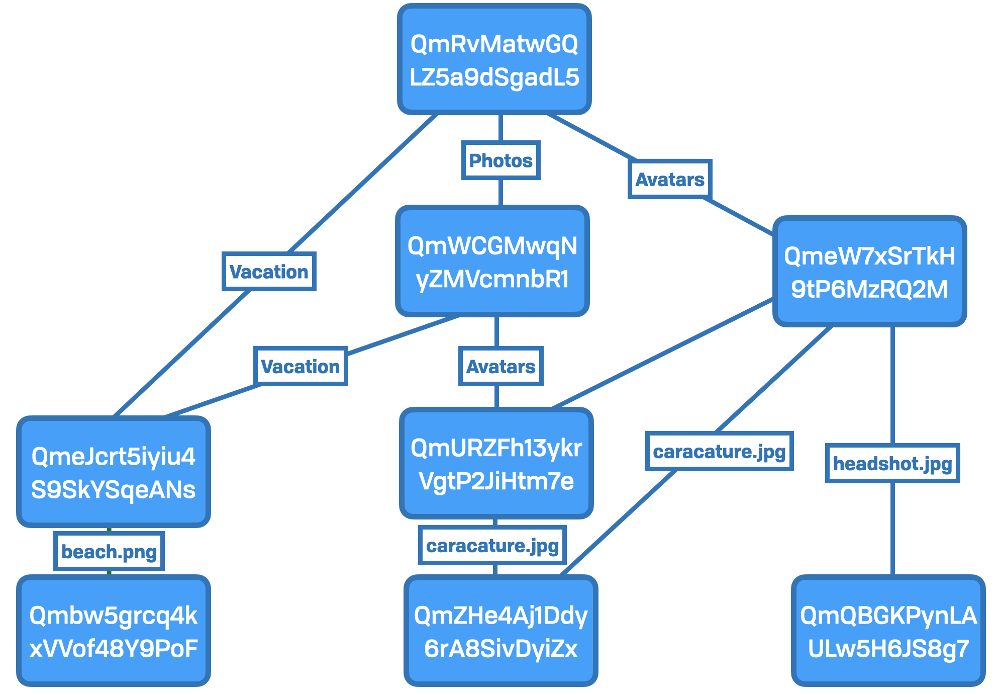
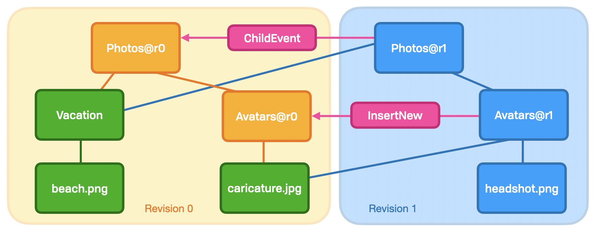

# Anatomy

WNFS is a Merkle DAG where the terminal nodes are _either_ empty directories or files. It is efficient in low-level operations \(e.g. deduplication, network sync\).

## Layers

The term "layer" refers exclusively to the stack of abstractions, with concrete or low-level constructs at the bottom, and progressively more abstract and ”human” as we go up. 

WNFS is built up from Merkle hash-linked structures, and needs to operate at several layers within the stack. WNFS is built on top of the [Interplanetary File System \(IPFS\)](https://ipfs.io/), but that may not always be the case. The core requirement is [content addressing](https://en.wikipedia.org/wiki/Content-addressable_storage). As such, many of the abstractions are slightly different from the raw IPFS ecosystem.

### Block Layer 🧱

This layer describes how we need to concretely represent our data in memory or to the network. This is roughly analogous to the disk representation in a typical local file system. The nouns of this layer are content addresses, Merkle structures, raw bytes, and the like.

Here is how storage looks to the block layer:



### File Layer 📑

The file layer adds additional structure over the protocol layer, with richer semantics that describe standard low-level filesystem metaphors. This includes files, directories, headers, access control, and so on. This abstracts over various storage layouts and providers, from lazy-loaded in-memory structures and durable network storage.

Rather than CIDs and Merkle structures, we speak of files, directory hierarchy, and versioning. It presents a much richer view of the same data:

The example from the block layer would be interpreted as follows \(where `Photos@1` is the root node at the top of the block layer\)



### API Layer 🗄

The File System Layer is an abstraction  abstraction over the protocol

### Application Layer 📊

The application layer is fully in userland. This is where users or applications may rely on specific file formats, and includes their business logic.

## Section

WNFS has several well defined sections defined at the root of the DAG. These include \(but are not limited to\) the public, private, and shared sections. There is a strict separation between these sections, for many reasons, but importantly access control — both for users an a separation between userland and kernelspace.

## Node 

### Virtual Node

A virtual node \("vnode"\) is an abstraction over files and directories. It describes some basic structure that all nodes in the graph conform to:



```typescript
type VirtualNode = File | Directory | Symlink
```



```haskell
data VirtualNode
  = FileNode      File
  | DirectoryNode Directory
  | Symlink       DNSLink
```



### Encrypted Node

An encrypted node is a virtual node \(or subtype\) which has been encrypted. An external key is required to read this node. See the section on the private tree for more detail of the architecture of this in practice.



```typescript
read(key: AES256, eNode: Encrypted<VNode>): Result<Failure, VNode>
```



```haskell
read :: AES256 -> Encrypted VirtualNode -> Either Failure VirtualNode
```



### Node Segments

A node is broken into two segments: header and content. There are a number of reasons for this layout, not least of which is keeping the content \(userland\) in a strictly separated namespace from the header \(system managed\).

These segments are stored as separate nodes at the protocol layer, but together at the level of application abstraction.

```text
+---------------------------+
|        VirtualNode        |
|                           |
|  +--------+  +---------+  |
|  | Header |  | Content |  |
|  +--------+  +---------+  |
|                           |
+---------------------------+
```

#### Header

Contains information _about_ the node and its contents. This includes information such as node size, tags, caches, indexes, and pointers to previous versions. This segment _does_ cause changes in structure at the protocol layer with elements like previous version pointers.

The header is primarily system \(SDK\) managed, but may be influenced by the user \(e.g. adding tags\).


The information stored in the header segment is _descriptive._ It is structural at the protocol layer, but not at the application layer.


#### Content

The actual information storage and linking to other nodes. Links to the actual raw contents of a file. This is an internal detail, and that this is a separate segment is generally hidden from end users.


The information stored in the content segment is primarily _operational._ It contains the primary semantic links that get exposed to the end user.


## DAG Reduction

A copy of a larger structure, with some data removed. This process is inherently lossy by definition, and never introduces new information to the reduction.

### Example

`pretty` is a DAG reduction of the `public` section. It's a reduction index because it contains precisely the same files and paths, but with extra detail removed. This is held directly in the DAG to facilitate human readable URLs.

