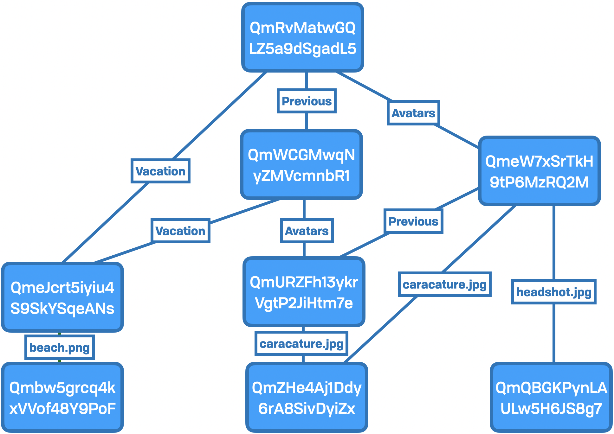
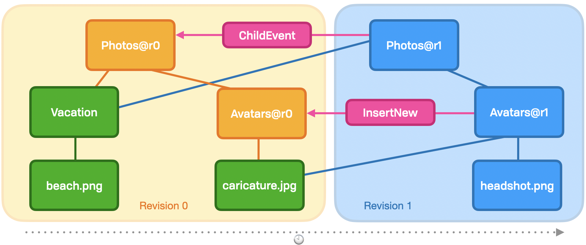

# Layers

The term "layer" refers exclusively to the stack of abstractions, with concrete or low-level constructs at the bottom, and progressively more abstract and ”human” as we go up. 

WNFS is built up from Merkle hash-linked structures, and needs to operate at several layers within the stack. WNFS is built on top of the [Interplanetary File System \(IPFS\)](https://ipfs.io/), but that may not always be the case. The core requirement is [content addressing](https://en.wikipedia.org/wiki/Content-addressable_storage). As such, many of the abstractions are slightly different from the raw IPFS ecosystem.

## Data Layer 💾

This layer describes how we need to concretely represent our data in memory or to the network. This is roughly analogous to the disk representation in a typical local file system. The nouns of this layer are content addresses, Merkle structures, raw bytes, and the like.

Here is how storage looks to the data layer:

## File Layer 📑

The file layer adds additional structure over the protocol layer, with richer semantics that describe standard low-level filesystem metaphors. This includes files, directories, headers, access control, and so on. This abstracts over various storage layouts and providers, from lazy-loaded in-memory structures and durable network storage.

Rather than CIDs and Merkle structures, we speak of files, directory hierarchy, and versioning. This layer also handles automated conflict resolution.

This layer knows about several well defined sections defined at the root of the DAG. These include \(but are not limited to\) the public, private, and shared sections. There is a strict separation between these sections, for many reasons, but importantly access control — both for users and as separation between userland and kernelspace.

It presents a much richer view of the Data Layer. The example given above would be interpreted as follows, where `Photos@1` is the root node \(at the top of the Block Layer diagram\).

## API Layer 🗄

The File System Layer is an abstraction over the File Layer. This contains many analogies to the common Unix filesystem interfaces \(e.g. `ls`, `cat`, `mkdir`\), the transactional interface, and browser events.

## Application Layer 📊

The application layer is fully in userland. This is where users or applications may rely on specific file formats, and includes their business logic.

