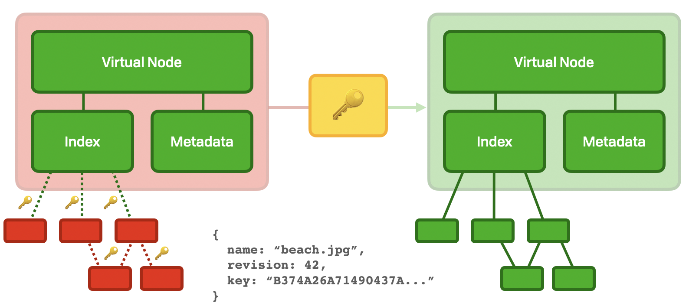
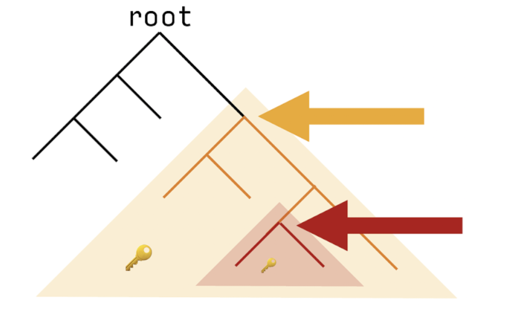

# CryptDAG

A cryptDAG is a recursive encrypted structure. Each file has its own UUID, and each revision has a unique key \(see `Spiral Ratchet`\). Directories also have their own UUID and key, but additionally contain the keys for their children. The structure is then scrambled and placed in a hash tree via their namefilter \(see `Namefiter`\).

Walking down this structure lets the user "discover" or "materialize" the original DAG structure.

Sharing the decryption key for some node provides access to its children from that point forward in time. Historical access is only available if the user has an entry point further back in time.

