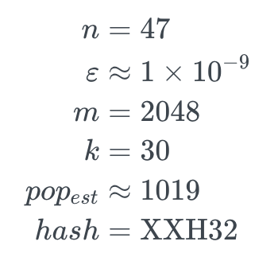
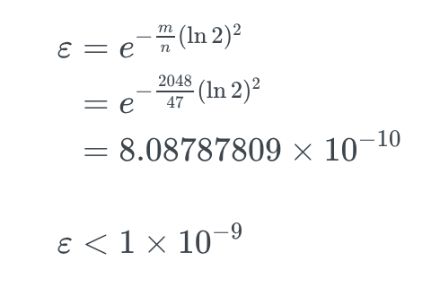
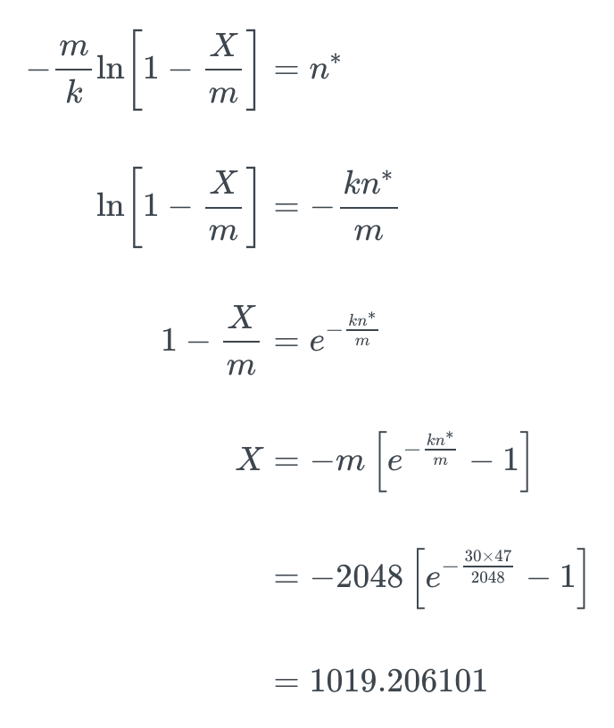

# Namefilter

At the data layer, each secret node \(SNode\) is placed in a table and named with a namefilter. This is a [generalized combinatoric accumulator](https://www.jstage.jst.go.jp/article/transinf/E91.D/5/E91.D_5_1489/_pdf/-char/en) \(GCA\), which in turn is essentially the Bloom construction of the [Nyberg hash accumulator](https://link.springer.com/content/pdf/10.1007%2F3-540-60865-6_45.pdf).

## Private Pathing

Much of this is covered elsewhere, but it is helpful for discussing why the namefilter is how it is.

Namefilters are used as private paths. Instead of human-readable names, WNFS uses randomly-generated inumbers. A namefilter is thus a set of the randomly-generated inumbers on this path. The inumbers are nonces — they have no intrinsic meaning other than to provide a unique identity for a single file over time. They are not rotated on update.

The set-like property of forgetting the order is important: it should be very hard \(read: impossible except edge cases\) to infer the hierarchical relationship between any two nodes.


Namefilters are _not_ a content address. They are based on the inumbers used to construct that path. This is important for validating if a namefilter is allowed to be constructed \(via UCAN, see below\).


## Parameters

Namefilters are 2048-bit Bloom filters. These hold 47 path segments, and achieve a one-in-a-billion false positive rate with 30 hashes. Formally:




If later required, doubling `n` and `m` leaves `ε` and `k` constant. See [here for pretty graphs](https://hur.st/bloomfilter/?n=47&p=&m=2048&k=30) \(useful for parameter tuning, verified manually\).


### Hash Function

Many Bloom filter implementations are optimized for speed, not consistency. We have chosen the [XXH32](https://cyan4973.github.io/xxHash/) \(i.e. 32-bit\) algorithm. It is about as fast as XXH64 for 256-bit \(i.e. small\) data.

XXH32 is very portable. It can be implemented within JavaScript number system \(at time of writing, ES2021 and earlier\). It also can be natively implemented on any 32-bit machine, or on common 64-bit machines with a 32-bit compatability mode, such as [AMD64](https://www.amd.com/system/files/TechDocs/24594.pdf).

However, for every element inserted into the Bloom filters we need `k = 30` different hash functions. We get these by invoking XXH32 with the seeds 0 to 29 \(inclusive\).

```typescript
function* indicesFor(element: Uint8Array) {
  const k = 30
  const m = 2048
  for (let i = 0; i < k; i++) {
    yield xxHash32(/* data to hash */ element, /* seed */ i) % m
  }
}
```

### Max Popcount / Hamming Saturation

It is not possible to know an accurate count of the number of elements in a Bloom filter by simply looking it at. This is both a blessing \(obsfucation\) and a curse \(convenience\). We cannot rely on having exactly `n` elements in a filter when inserting more elements into an existing filter.

Bloom filters admit \(roughly\) how many elements they contain, and are relatively easy to correlate by their Hamming distance. To work around this issue with obfuscation, namefilters deterministically saturate the remaining space, filling just under _half_ of the available filter, while maintaining a very low false positive rate. The idea is to fill the namefilter with a constant Hamming weight, but still be easily constructible by someone with the bare namefilter.

To satisfy these constraints, we have chosen a target saturation of 1019, with some tolerances. 1019 is chosen as it represents the 47 elements, yielding the lower bound false positive rate.

This is granted some tolerances: since every element takes _up to_ 30 bins, we don't know how many bits will overlap. As such, we need to find the overshoot of 1019 elements, and take the previous value. This requires limited backtracking.

## Bare / Unsaturated Namefilter

The bare namefilter for any node is the parent's bare namefilter plus the current node's inumber. This bare namefilter is passed down to the child SNodes and encrypted along with other header information.

The root node has no parent, so its bare namefilter is merely the SHA-256 hash of its identity hash placed in a Bloom filter. A child node is passed its parent's bare namefilter, and includes it with the SHA-256 of its key to generate its namefilter.

```javascript
const bareParent = 0x5891b5b522d5df086d0ff0b110fbd9d21bb4fc7163af34d08286a2e846f6be03
const iNumber = 0xe258d248fda94c63753607f7c4494ee0fcbe92f1a76bfdac795c9d84101eb317
const bareFilter = bareParent ^ inumber
```


### inumber

To preserve the cryptree property, key rotation requires access to the parent. Adjusting the inumber is implicit in the bare namefilter, and thus the inumber does not need to be held separately. It is only used at initial creation to create a child path.


## Private Versioning

WNFS is a persistent, versioned file system. Including the version is essential for many parts of the system \(seen throughout the rest of this section\). In principle this can be any counter, including simple natural numbers, depending on the design goals of the broader system.

WNFS uses a backward-secret spiral ratchet for versioning, which is described in its own section. This ratchet is hashed and added to the bare namefilter.

### Algorithm \(in Pseudocode\)

```typescript
const max: number = 1019
const hashCount: number = 30

const saturate = (barefilter: NameFilter): NameFilter {
  // Get the lower bound of remaining elements
  const lowerBound = Math.floor((max - barefilter.popcount()) / hashCount)

  // Quickly jump to the lower bound
  let filter = barefilter
  for (i = 0; i < lowerBound; i++) {
    filter = filter.add(sha(filter.toBytes()))
  }

  // Step more slowly though until comparison reached
  return saturatedUnderMax(filter)
}

// Closest without going over
const saturateUnderMax = (filter: NameFilter): NameFilter {
  const newFilter = filter.add(sha(filter.toBytes()))
  if (popcount(newFilter) > max) return filter
  saturatedUnderMax(newFilter)
}
```

In this way, we can deterministically generate very different looking filters for the same node, varying over the version number. The base filter stays inside the longer structure, . With an appropriately configured filter, this provides multiple features:

## Design Considerations

GCAs were chosen over other [arguably more sophisticated](https://www.fim.uni-passau.de/fileadmin/dokumente/fakultaeten/fim/forschung/mip-berichte/MIP_1210.pdf) options for three main reasons: witness side, raw performance, and ease of implementation for web browsers. For example, we were unable to find a widely-used RSA accumulator library on NPM or Crates, but implementing a GCA is very straightforward.

Due to distinguishability, GCAs potentially leak some information about related, deeply-nested sibling nodes as the Hamming approaches zero. Our namefilter GCAs have a cardinality of 47 by default, which is much deeper than most file paths.

We considered using XOR or Cuckoo filters instead of class Bloom filters. XOR is very close to the theoretic efficiency limit, but is very new and the library untested. Cuckoo filters would provide around an additional 4 path segments with the same false-positive rate, but we lose the single-bit-collision of Bloom filters which is actually an advantage for obfuscation.

## Parameter Tuning Calculations

Because it's important to show your work™️

### False Positive Probability \(FPP\)



### Optimal Number of Hash Functions \(k\)


### Optimal Number of Elements \(n\) for Hash Count

Just rearranged from calculating `k`


### Optimal Popcount \(X\)

This is the formula to estimate the number of elements in a given Bloom filter \([source](https://en.wikipedia.org/wiki/Bloom_filter#Approximating_the_number_of_items_in_a_Bloom_filter)\)



