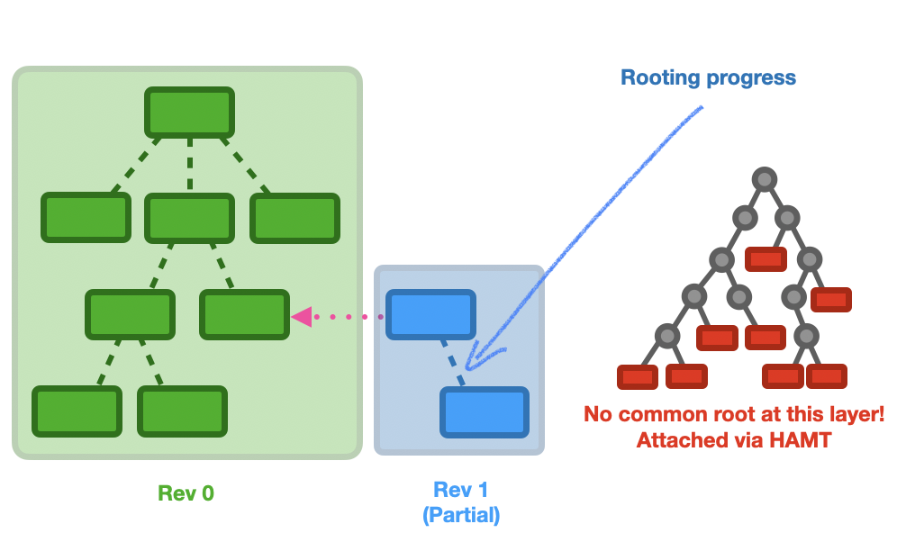
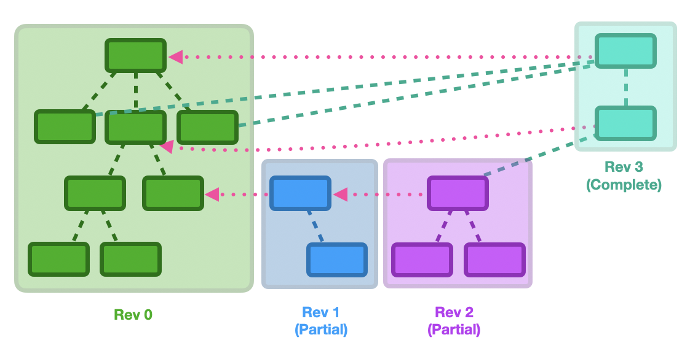

# Data Layer


This section describes how the `/private` partition would look to an **unauthorized** user. This is how the data is stored and propagated through the network only.


## Encryption

This layer is completely agnostic about file contents. By default, encryption is done via 256-bit AES-GCM \(via the [WebCrypto API](https://www.w3.org/TR/WebCryptoAPI/)\) but in principle can be done with any cipher \(e.g. [AES-SIV-GCM, ChaCha20-Poly1305](https://soatok.blog/2020/07/12/comparison-of-symmetric-encryption-methods/)\). Everything described below is compatible with any symmetric cipher.


To see more about what is found _inside_ an SNode when unencrypted, please see the Private File Layer section.


## Secure Content Prefix Tree

Unlike the public file system DAG, the private file system is stored as a tree. More specifically, this is a SHA256-based Merklized concurrent hash trie \(Merkle-[Ctrie](https://en.wikipedia.org/wiki/Ctrie), or "McTrie" 🍔\). The McTrie has a branching factor of 16. The weight was chosen to balance search depth with witness size, caching, and concurrent merge performance. This tree can hold over a million elements in 5 layers.


Note that is the namefilters that are Merklized in the McTrie, not the file contents


As we will explore in later sections, collisions are not possible in this tree thanks to content addressing, so clients can aggressively cache intermediate nodes. This is an append-only structure, so deletions are not supported. 

Practically, merges overwhelmingly contain shared intermediate nodes and leaves, but the worst-case for a heavily diverged tree is linear relative to the smaller tree. Being a prefix tree, there are no rotations. Tree merging forms a monoid, so concurrent merges are straightforward.

$$
\begin{array} {|r|r|}\hline Lookup & O(log\ n) \\ \hline Insert & O(log\ n) \\ \hline Merge & O(min(n, m)) \\ \hline Delete & ⊥ \\ \hline  \end{array}
$$

The prefixes are not the CIDs of the data, but rather the namefilter \(see relevant section\). CIDs are kept as leaves in this tree, but all intermediate nodes refer to the set of \(hashed\) keys used for access control. Intermediate nodes are lightweight and SHOULD be aggressivley cached.

This structure emulates a hash table of shape `Hash Namefilter -> Namefilter -> [CID]`. Terminal namefilter nodes may have multiple child CID leaves.

## Concurrency

This is a concurrent tree. Many contexts may be updating it at the same time without the ability to communicate directly \(e.g. network partition\). The namefilters themselves may have collisions, but the leaves cannot since they are hashes of the actual content. Conceptually, the same CID may live at multiple names in the McTrie, though this is extremely unlikely in practice.

Being an append-only data structure, merging in absence of namespace conflicts is very straightforward: place the new names in their appropriate positions in the tree. This can be done in high-parallel to further improve runtime performance.

> Last, let's consider the case where it is truly ambiguous what order to apply changes using the same example but with different visibility \[...\] Here, we have no "right" answer. Alice and Bob both have made changes without the other's knowledge and now as they synchronize data we have to decide what to do. Importantly, there isn't a _right_ answer here. Different systems resolve this in different ways.
>
> ~[ Hypermerge's Architecture Documentation](https://github.com/automerge/hypermerge/blob/master/ARCHITECTURE.md)

#### Multivalues-else-LWW

In the case of namespace conflicts, store both leaves. In absence of other selection criteria \(such as hard-coded choice\), pick the highest \(in binary\) CID. In other words, pick the longest causal chain, and deterministically select an arbitrary element when the event numbers overlap. This is a variant of multivalues, with nondestructive last-writer-wins \(LWW\) semantics in the case of a longest chain.


By default, WNFS automatically picks the the highest revision, or in the case of multiple values at a single version, the highest namefilter number. Here is one such example, where the algorithm would automatically chose `QmbX21...` as the default variant. The user can override this choice by pointing at `Qmr18U...` from the parent directory, or directly in the link. This is related to [preferred edges in a link/cut tree](https://en.wikipedia.org/wiki/Link/cut_tree#Preferred_paths).


Any observer may perform a merge to produce a valid WNFS structure. If an agent with read/write access performs such a merge, it is strongly recommended to do the following:

1. Lazily root new nodes \(see "Lazy Progress" below\)
2. Merge conflict branches, either merge the contents semantically, or simply select a preferred winner, and writing that as a new revision

## Secret VNode \(SNode\) Content

An SNode that has been secured in this way is called an ”secure virtual node”. The contents of these nodes is largely the same as their plaintext counterparts, plus a key table for their children.

The core difference is the encrypted storage \(protocol layer\), and secrecy of the key used to start the decryption process. The key is always external to the SNode, and its not aware of which key was used to create it. Here at the protocol layer, we are not directly concerned with the contents.

```haskell
data McBranch
  = McLeaf CID Namefilter FileContent
  | McTree CID

data McTree = McTree
  { x0 :: Maybe SNode -- NOTE May terminate "early" if no 
  , x1 :: Maybe SNode
  , -- ...
  , xE :: Maybe SNode
  , xF :: Maybe SNode
  }
```

## Cooperative Rooting

Since the ratchets and namefilters are deterministic, we can look up a version in constant time from the McTrie. Below we go into greater detail about how progress is ensured, but is relevant to lookup.

If you have a pointer to a particular file, there is no way of knowing that you have been linked to the latest version of a node. The information that you do have includes everything that you need to construct a name filter.

* The current node’s identity nonce
* The ratchet of the current node \(stored in the node\)
* This parent's bare name filter \(stored in the node\)

The user must always ”look ahead” to see if there have been updates to the file since they last looked. The three most common scenarios are that:

1. No changes have been made
2. There have been been a small number of changes
3. There have substantial changes since

### Fast Forward Mechanism

#### Simplified

To balance these scenarios, we progressively check for files at revision `r + 2^n` , where `r` is the current revision, and `n` is the search index. First we check the next revision. If it does not exist, we know that we have the latest version. If it does exist, check `r + 2`, then `r+4`, `r+8` and so on. Once there’s a missing version, perform a binary search. For example, if looking at a node at revision 42 that has been updated 123 times since your last recorded pointer, it takes 14 checks \(roughly `O(2 log n)`\) to find the latest revision.


#### Attack Resistance

A fully deterministic lookup mechanism is open to an attack where the malicious user only writes nodes that are known to be on the lookup path, forcing a linear lookup time against a large number of nodes. To work around this, we add dithering \(noise\) to the lookup values while looking performing large jumps: 

$$
rev(current, n, m) = current + 2^n - 2^m - random(0..(2^{n-1} - 2^{m-1}))
$$

```haskell
-- WIP WIP WIP
fastFoward initial = fastForward' 1 0
  where
    forward n forwardExp backwardExp =
      n + forwardExp + 1
    
    backward
let
  current   = current
  
  forwards  = 1
  backwards = 0

next base n m =
  let diff = 2^n - 2^m
  dither <- if diff < 1024 then pure 0 else rand 0 diff
  return (base + diff - dither)
    
  


```

| Revision Number | Exists |
| :--- | :--- |
| 42 + 1 = 43 | Yes |
| 42 + 2 = 44 | Yes |
| 42 + 4 = 46 | Yes |
| 42 + 8 = 50 | Yes |
| 42 + 16 = 58 | Yes |
| 42 + 32 = 74 | Yes |
| 42 + 64 = 106 | Yes |
| 42 + 128 = 170 | No — First overshot! We now have an upper bound |
| 42 + 96 = 138 | Yes |
| 42 + 112 = 154 | Yes |
| 42 + 120 = 162 | Yes |
| 42 + 124 = 166 | No |
| 42 + 122 = 164 | Yes |
| 42 + 123 = 165 | Yes — No more search space, so found! |

## Lazy Progress

Anyone that can update a pointer can make permanent revision progress for themselves \(in `localStorage` or as a symlink in their FS\), or others if they have write access to this file system.

As the user traverses the private section \(down the Y-axis, across the X-axis\), they attempt to make progress in time \(forwards in the Z-axis\). If they find a node that’s ahead of a link, it updates that one link in memory. At the end of their search in 3-dimensions \(with potentially multiple updates\), they write the new paths to WNFS.

Note that they only need to do this with the paths that they actually follow! Progress in revision history does not need to be in lock step, and will converge over time.

Not all users with write access have the ability to write to the entire DAG. Writing to a subgraph is actually completely fine. Each traversal down a path will reach the most recently written node. The search space for that node is always smaller than its previous revisions, and can be further updated with other links or newer child nodes.

This contributes back collaboratively to the overall performance of the system for all users. If a malicious user writes a bad node, they can be overwritten with a newer revision by a user with equal or higher privileges. Nothing is ever lost in WNFS, so reconstructing all links in a file system from scratch is _possible_ \(though compute intensive\).





## Name Graveyard

The graveyard is a RECOMMENDED safeguard against writing to a file that will no longer be followed. It is a prefix tree containing hashes of all file descriptors that have been retired. McTrie merges must include all files even if they fail this check; it is only here as a convenience to prevent agents with imperfect knowledge to be aware that a particular path is no longer followed.

