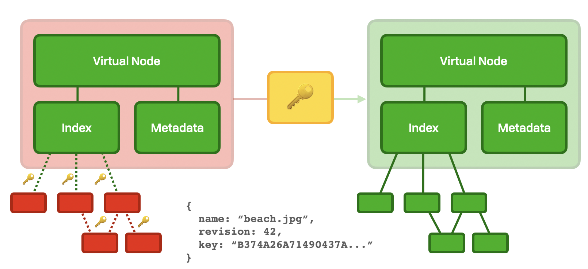

# File Layer

The platform layer has decrypted \(or ”unlocked”\) access to SNodes.

The normal lifecycle for secret nodes is for the user to start by decrypting some node, revealing its plaintext contents. If this contains a directory, then it will contain human-readable links and further pointers to more nodes. By following these pointers and decrypting their contents, the users "discovers" or "materializes" the plaintext file DAG.



## Unlocking

To read a node, the user needs to have the key either available from another node which they have access to, in the `shared_with_me` or `shared_by_me` sections, or stored on their system directly.

To read or ”unlock“ a private node, you need the node and its key:

```haskell
data UnlockPointer = UnlockPointer
  { rawKey :: Bytes
  , index  :: SHA256 Namefilter
    -- , algorithm :: CryptoAlgorithm -- assumed AES-GCM for now
  }

unlock :: UnlockPointer -> DecryptedNode
```

### Unlocked Private Node Schema

```haskell
data DecryptedNode
  = DecryptedDirectory PrivateDirectory
  | DecryptedFile      PrivateFile
  -- Links
  | DecryptedSymlink   NameFilter CryptoAlgorithm Bytes
  | DecryptedMovedTo   UnlockPointer

data DecryptedFile = DecryptedFile
  { metadata   :: Metadata -- NOTE includes events, &c
  , bareName   :: BareNameFilter
  , revision   :: SpiralRatchet
  , rawContent :: InlineFile | [Namefilter] -- MAY be split across many sections to obscure files
  }

data DecryptedDirectory = DecryptedDirectory
  { metadata       :: Metadata
  , bareNameFilter :: BareNameFilter
  , ratchet        :: SpiralRatchet
  , links          :: Map Text UnlockPointer
  }
```

### Secure Recursive Read Access

The private section is recursively protected with AES-256 encryption. This is to say that each vnode is encrypted with an AES key, and each of its children are encrypted separately with their own randomly derived AES keys. A node holds the keys to each of its children. In this way, having a key for a node also grants read access to that entire subgraph.

## Content Access

The file content and header are stored separately. The decryption key \(and thus namefilter\) is derived from the header's key by taking its SHA256.

```javascript
const { ratchet } = myFile.header
const fileKey = sha256(ratchet.toBytes())
```

## Revocation

Read access revocation is achieved by changing the AES key and linking to a higher node. As such, it is not recommended for a user with write permissions to rotate the key of the root of their subgraph, unless they’re able to redistribute that key somehow. For example, the root user is able to update the key for the root of the graph, and distribute that key to their other user instances by the `shared_by_me` mechanism.


A node with no valid key pointing at it is said to be orphaned, since it has no parents that are capable of accessing the data locked in the node. It may be marked for garbage collection by the root user.


### Decrypted Nodes

Since the structure of a cryptDAG is hidden completely from the outside world, there is a very strict separation between the platform layer, and how things are organized at the protocol layer. There are still two layers, but the protocol layer is more closely relied on by the platform layer.

The protocol layer describes encrypted nodes, with a special naming scheme and organized in a HAMT \(see Data Layer\). These can be converted to a decrypted virtual node via an _external_ symmetric key.

## Key Rotation

While the ratchet revision maintains forward-secrecy, backwards-secrecy is achieved with a ratchet reset \(which is equivalent to a key rotation\). This involves:

1. Placing a `MovedTo` node containing a pointer to the new namefilter
2. Re-sharing the rotated ratchet with all authorized users
3. Adding the file descriptor to the file descriptor graveyard

See Share for more information on how to share keys with other users.


