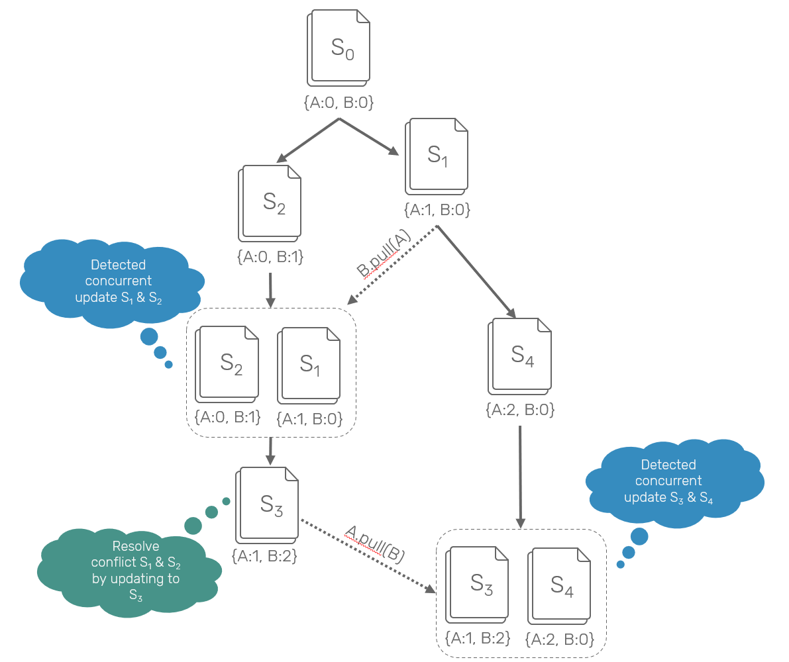
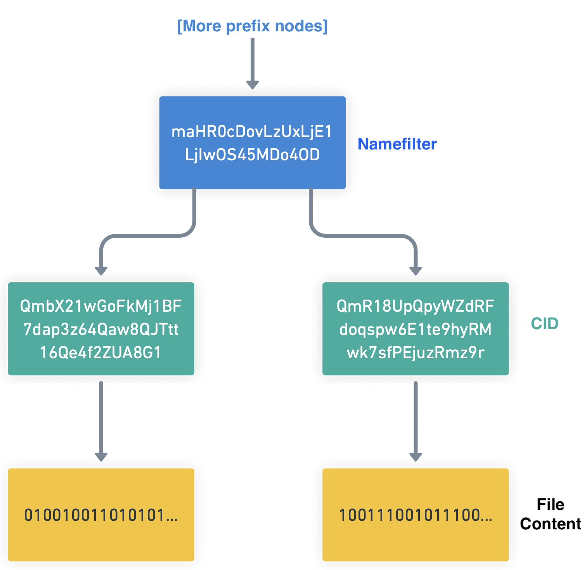

# Data Layer


This section describes how the `/private` segment would look to an **unauthorized** user. This is how the data is stored and propagated through the network only.


## Encryption

This layer is completely agnostic about file contents. By default, encryption is done via 256-bit AES-GCM \(via the [WebCrypto API](https://www.w3.org/TR/WebCryptoAPI/)\) but in principle can be done with any cipher \(e.g. [AES-SIV-GCM, ChaCha20-Poly1305](https://soatok.blog/2020/07/12/comparison-of-symmetric-encryption-methods/)\). Everything described below is compatible with any symmetric cipher.


To see more about what is found _inside_ an SNode when unencrypted, please see the Private File Layer section.


## Secure Content Prefix Tree

Unlike the public file system DAG, the private file system is stored as a tree. More specifically, this is a SHA256-based [Modified Merkle Patricia Tree \(MMPT\)](https://eth.wiki/en/fundamentals/patricia-tree), with a branching factor of 16. The weight was chosen to balance search depth with Merkle witness size, caching, and concurrent merge performance. This tree can hold over a million elements in 5 layers.

As we will explore in later sections, collisions are not possible in this tree thanks to content addressing, so clients can aggressively cache intermediate nodes. This is an append-only structure, so deletions are not supported. 

Practically, merges overwhelmingly contain shared intermediate nodes and leaves, but the worst-case for a heavily diverged tree is linear relative to the smaller tree. Being a prefix tree, there are no rotations. Tree merging forms a monoid, so concurrent merges are straightforward.

$$
\begin{array} {|r|r|}\hline Lookup & O(log\ n) \\ \hline Insert & O(log\ n) \\ \hline Merge & O(min(n, m)) \\ \hline Delete & ⊥ \\ \hline  \end{array}
$$

The prefixes are not the CIDs of the data, but rather the namefilter \(see relevant section\). CIDs are kept as leaves in this tree, but all intermediate nodes refer to the set of \(hashed\) keys used for access control. Intermediate nodes are lightweight and SHOULD be aggressivley cached.

This structure emulates a hashtable of shape `Hash Namefilter -> Namefilter -> [CID]`. Terminal namefilter nodes may have multiple child CID leaves.

### Concurrency

This is a concurrent tree. Many contexts may be updating it at the same time without the ability to communicate directly \(e.g. network partition\). The namefilters themselves may have collisions, but the leaves cannot since they are hashes of the actual content. Conceptually, the same CID may live at multiple names in the MMPT, though this is extremely unlikely in practice.

Being an append-only data structure, merging in absence of namespace conflicts is very straightforward: place the new names in their appropriate positions in the tree. This can be done in high-parallel to further improve runtime performance.

> Last, let's consider the case where it is truly ambiguous what order to apply changes using the same example but with different visibility \[...\] Here, we have no "right" answer. Alice and Bob both have made changes without the other's knowledge and now as they synchronize data we have to decide what to do. Importantly, there isn't a _right_ answer here. Different systems resolve this in different ways.
>
> ~[ Hypermerge's Architecture Documentation](https://github.com/automerge/hypermerge/blob/master/ARCHITECTURE.md)

#### LWW & Multivalues

In the case of namespace conflicts, store both leaves. In absence of other selection criteria \(such as hardcoded choice\), pick the lowest \(in binary\) CID. In other words, pick the longest causal chain, and deterministically select an arbitrary element when the event numbers overlap. This is a varaint of multivalues, with nondestructive last-writer-wins \(LWW\) semantics in the case of a longest chain.



By default, WNFS will automatically pick the the highest revision, or in the case of multiple values at a single version, the highest namefilter number. Here is one such example, where the algorithm would automatically chose `QmbX21...` as the default variant. The user can override this choice by pointing at `Qmr18U...` from the parent directory, or directly in the link.



## Secret VNode \(SNode\) Content

An SNode that has been secured in this way is called an ”secure virtual node”. The contents of these nodes is largely the same as their plaintext counterparts, plus a key table for their children.

The core difference is the encrypted storage \(protocol layer\), and secrecy of the key used to start the decryption process. The key is always external to the SNode, and its not aware of which key was used to create it. Here at the protocol layer, we are not directly concerned with the contents.

```haskell
data SNode
  = SLeaf Namefilter FileContent
  | STree

data STree = STree
  { x0 :: Maybe SNode -- NOTE May terminate "early" if no 
  , x1 :: Maybe SNode
  , -- ...
  , xF :: Maybe SNode
  }
```


