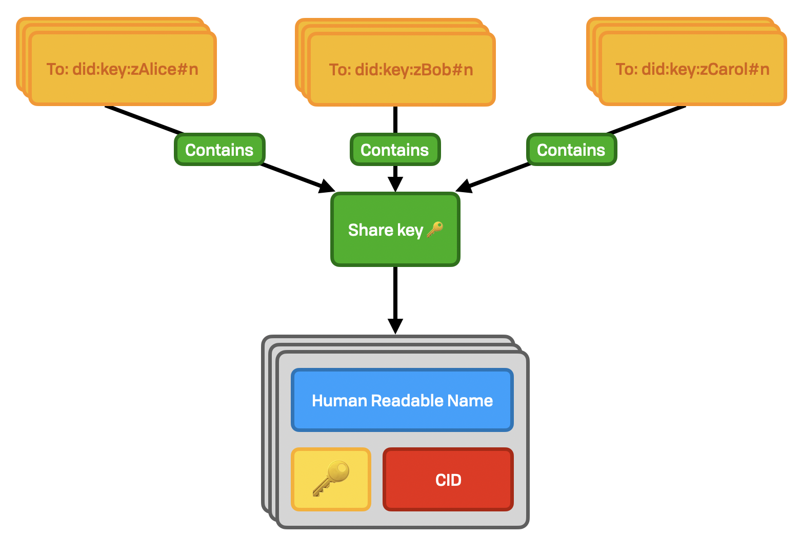

# Share

There are three cases where we need to exchange data in an offline manner. Fundamentally these are all variants on ”I need to make this update, but don’t have the other party online.”

1. Shared _by_ me
2. Shared _with_ me \(including self-share\)

## Exchange & Share Keys

Sharing information with a user that’s offline is easy thanks to authenticated key exchange. All WNFS users widely distribute a list of public 2048-bit RSA public keys — their non-exportable ”exchange keys” — as DIDs at a well-known location \(`/public/.well-known/exchange/*`\). These RSA keys are used to send a symmetric key to a recipient; the "share key". This symmetric key is then used to decrypt pointers, UCANs, and other messages.

The share keys may be rotated. This is done as normal as with any other versioned file. As there's only a single recipient per key, there is no need for backwards secrecy, and so we can use a simple natural number to represent the version, and to do seek-head.

## Shared By Me

### Layout

This is a one-to-many exchange. Because of how account linking works, any given user will typically have a small number of exchange keys \(in the range of 1 to 5\). Each user only has access to a single key at any given time, so the sender will use a single key to share with multiple recipient keys:



The actual file pointers \(in grey above\) are only generated once per permissions group. Encrypting the share key with a group is done per key, but containing the same decryption key. Thus, the top-level key MAY shared across multiple users. Sharing with a single user is a special case of the above.

The pointer keys themselves are not versioned. Looking up newer versions of particular files once the entry point is decrypted is done in the usual way from the private partition. Updating the share key is done by creating a new key and placing it at the incremented version number.

```haskell
keyNamefilter :: DID -> DID -> Natural -> Namefilter
keyNamefilter receiverExchangeDID senderSigningDID version =
  Namefilter.empty
    |> Namefilter.insert baseSHA
    |> Namefilter.saturate
  where
    baseSHA = sha256 (receiverExchangeDID <> senderSigningDID <> version)
    
-- Pointer names are unique
pointerNamefilter :: SymmetricKey -> Namefilter
pointerNamefilter key =
  Namefilter.empty
    |> Namefilter.insert (sha256 key)
    |> Namefilter.saturate
```

If a user from the shared group has their access revoked, they simply are excluded from the updated version share.

### Content

The content of these files is a very straightforward JSON array containing UCANs or read keys. UCANs are described elsewhere. A read keys look like this:

```typescript
interface SharedKey {
  cipher:  KeyType; // e.g. "AES-256"
  key:     Bytes;
  pointer: NameFilter;
}
```

## Shared With Me

The inverse of "shared by me" is "shared with me". Here the root user exchange keys are the recipient. This is used for two reasons:

1. Copying keys to your own file system to ensure that you have a copy in the case that the original file system gets overwritten
2. Distribution to other linked devices

This looks nearly identical to the "shared by me" section.

