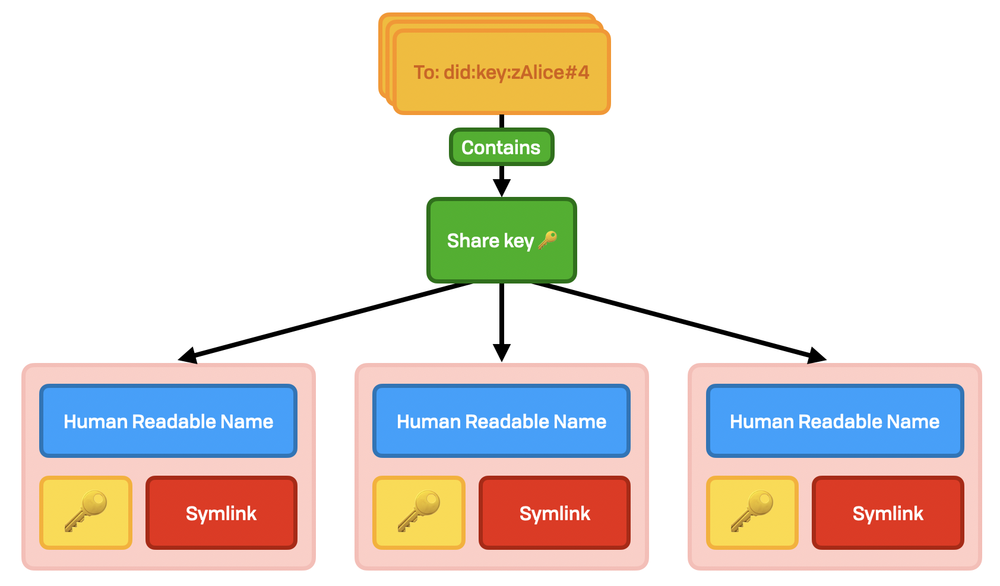

# Share

There are three cases where we need to exchange data in an offline manner. Fundamentally these are all variants on ”I need to make this update, but don’t have the other party online.”

1. Shared _by_ me
2. Shared _with_ me \(including self-share\)

## Exchange & Share Keys

Sharing information with a user that’s offline is easy thanks to authenticated key exchange. All WNFS users widely distribute a list of public 2048-bit RSA public keys — their non-exportable ”exchange keys” — as DIDs at a well-known location \(`/public/.well-known/exchange/*`\). These RSA keys are used to send a symmetric key to a recipient; the "share key". This symmetric key is then used to decrypt pointers, UCANs, and other messages.

The share keys may be rotated. This is done as normal as with any other versioned file. As there's only a single recipient per key, there is no need for backwards secrecy, and so we can use a simple natural number to represent the version, and to do seek-head.

## Shared By Me

### Layout

This is a one-to-many exchange. Because of how account linking works, any given user will typically have a small number of exchange keys \(in the range of 1 to 5\). Each user only has access to a single key at any given time, so the sender will use a single key to share with multiple recipient keys in a tree structure:



```javascript
saturateFilter(receiverExchangeDID, receiverExchangeDID <> version)
```

Inside the directory are one or more encrypted files with the name of the sender’s public key which was used to encrypt it. When a recipient decrypts this file, they are expected to copy the information to their `authz_out` directory in their own FLOOFS, or at least cache the  information on their local system.

### Content

The content of these files is a very straightforward JSON array containing UCANs or read keys. UCANs are described elsewhere. Read keys look like this:

```typescript
interface SharedKey {
  cipher:  KeyType; // AES256
  key:     Bytes;
  pointer: NameFilter;
}
```

## Shared With Me \(authz\_in\)

The inverse of `authz_out` is `authz_in`, where the FLOOFS root user is the recipient. This is their cache of keys, credentials, and encrypted pointers that have been shared with them.

This is important to have in case a local cache is cleared, they link another machine, or the original copy in a remote `authz_out` is removed. The mechanism is straightforward: information is kept in a single file, encrypted with an AES256 key.

This AES key is distributed to all linked instances. This key can be rotated at any time \(e.g. if comprimised\). As such, a copy is also shared with all ofthe user’s exchange keys. The sender is signaled by the name of the directory \(a hashed value for space reasons\).

```text
${username}.fission.name
  |
  +——authz_in
       |
       +——shared.json.crypt
       |
       +——G9N5KiVYLKbQLpTsnaTgr5E8kt95F56G7oLMhPryVz1m
            |
            +——4GVjkeLXt1h3xnay5dVF6Ekdjw9RqYFKYH3rUjk9CHHy.aes256.dh
            |
            +——7ZXatFQWw3tJsDHhozotH6V4D8vKqjenTGf2sz3XfFzA.aes256.dh
            |
            +——FkBvWMAy14HpwBtN9wFMmEYDErgzp5KiBragAQPsib1Z.aes256.dh
```

