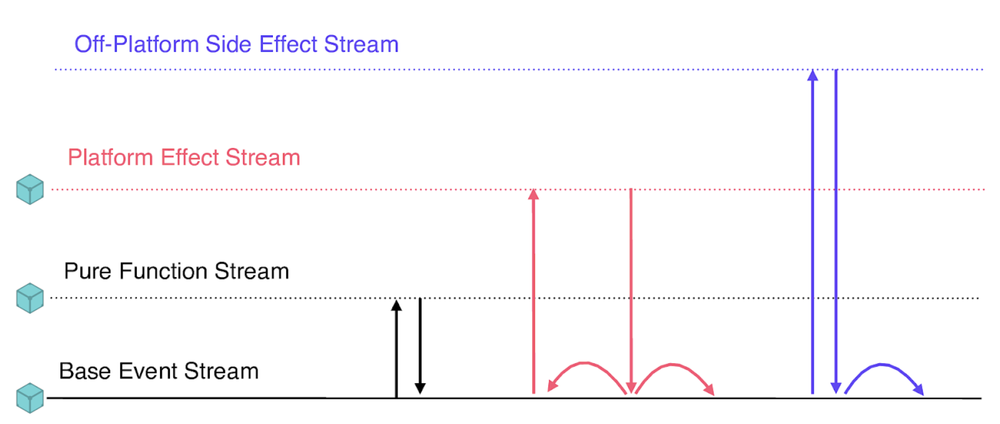

# Portable Compute

There is an abundance of personal computing devices on a scale only seen in the past few years. These computers are both very capable, and yet still have constraints such as onboard storage and battery life.

With unified storage secured with granular cryptographic techniques, the actual location of computation becomes significantly less important. Computing directly on device has zero latency, but may come with other costs.

In this setting "code is data". Further, in a pure environment, functions can be seen as merely incomplete data. If set up correctly, every intermediate step, every function application, and every output can be moved around, cached, and shared. Why recompute a function that has been run before with those inputs? Is there some novel function to be run on a large data set? Send it a compute cluster and fetch the result lazily. Multiple devices can share workloads.

Sometimes mistakes happen, and an incorrect result is returned. Thanks to a persistent data substrate, it's possible to drop in the correct result and repair the current state. There are limitations: recomputation takes resoucres, and any real world action that you took in response to some information cannot be rewound.

