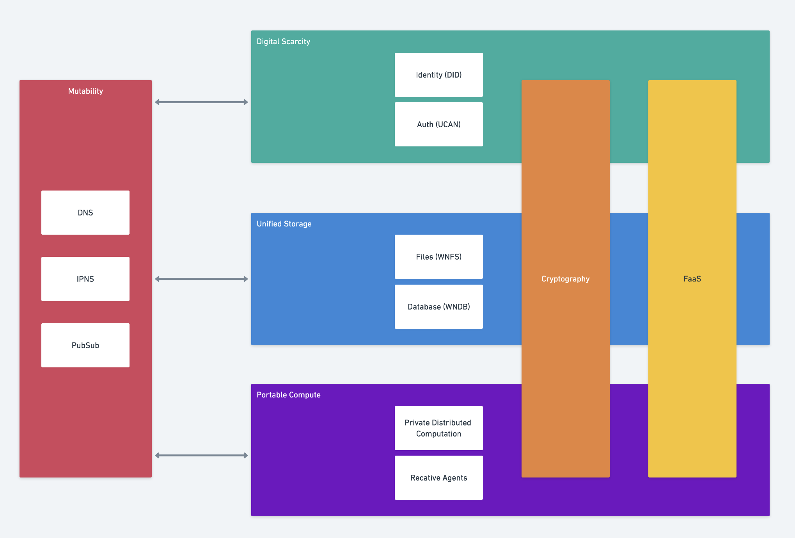
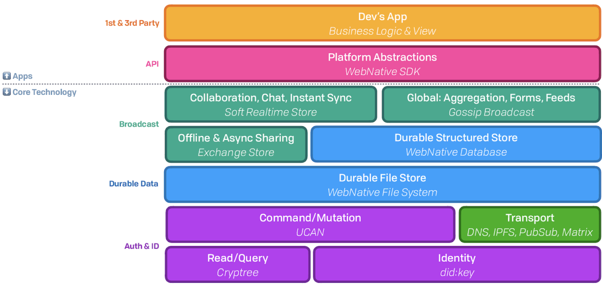

# High Level Architecture

The Fission architecture is made up of six modular components, which group loosely into three segments:

1. Unified Storage

   a. Files

   b. Database

2. Digital Scarcity

   a. Identity

   b. Assets

3. Portable Compute

   a. Private & Trusted

   b. Public & Trustless

Cutting across these are two second-order modules that rely on the three core areas:

1. Encryption
2. Functions-as-a-Service

The vast majority of end users will not have cryptographically secured routing available locally for some time. To bridge this gap, Fission leverages public DNS infrastructure as a backward-compatibility bridge.

